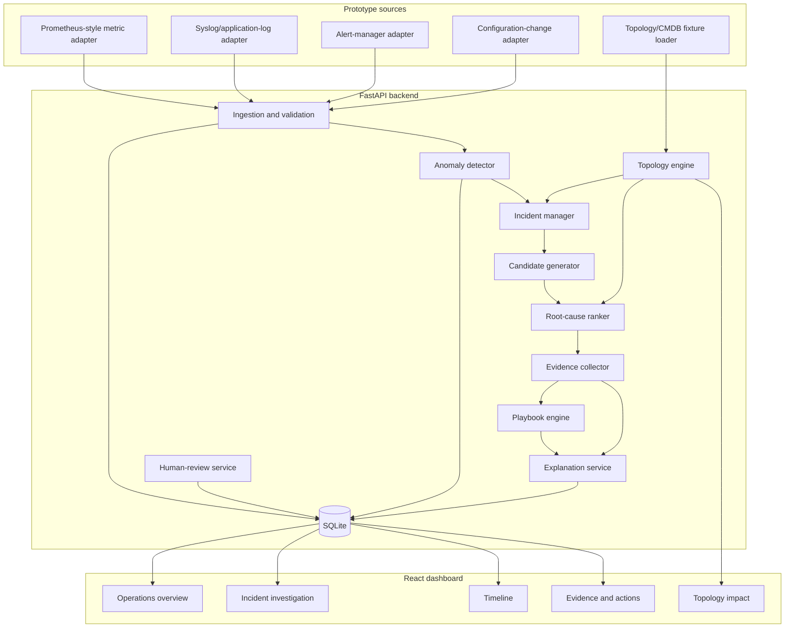
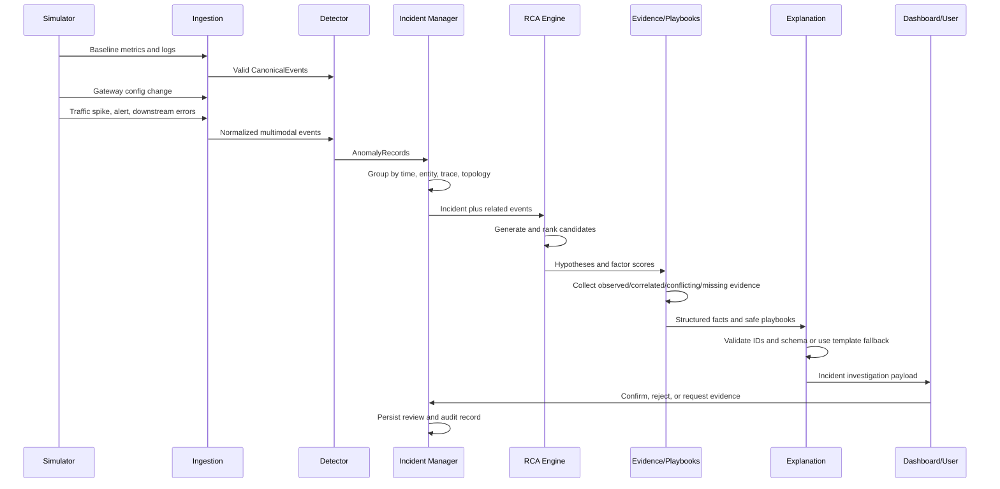

# Network Anomaly Root-Cause Assistant — Prototype Blueprint

**Document status:** Final team implementation guide and contract authority  
**Version:** 1.4  
**Target:** Hackathon working prototype  
**Design lineage:** `Ideation.md`; this blueprint is the implementation authority  
**Dataset policy:** NSL-KDD, UNSW-NB15, HDFS, and BGL are reference material only. They are not runtime dependencies and are not presented as one correlated production environment.

---

## 1. Purpose of This Blueprint

This document defines the shared contracts, boundaries, data model, APIs, ownership lanes, integration sequence, and acceptance criteria for the prototype. Team members should be able to implement their assigned modules concurrently without inventing incompatible schemas or changing another module's internals.

The blueprint is intentionally opinionated. Any change to a **frozen contract** must be proposed and reviewed before implementation because it may affect every workstream.

### 1.1 Prototype outcome

The final system must demonstrate this complete loop:

```text
Simulated multimodal events
  -> validated canonical events
  -> anomaly signals
  -> correlated incident
  -> ranked probable root-cause hypotheses
  -> observed, correlated, conflicting, and missing evidence
  -> incident timeline and topology impact
  -> safe diagnostic/remediation suggestions
  -> human decision and audit trail
```

### 1.2 Core product claim

The prototype assists an operator in investigating a network/system anomaly. It does not claim to prove causation. It ranks hypotheses using deterministic evidence and clearly communicates uncertainty.

### 1.3 Contract authority and change policy

This file is the implementation source of truth. If `Ideation.md`, `design.md`, a mock payload, a fixture, or existing code conflicts with this blueprint, this blueprint wins until a reviewed revision changes it.

Contract changes use this sequence:

1. Record the proposed change and affected workstreams in `docs/api-decisions.md`.
2. Update the backend Pydantic contract and its JSON example.
3. Regenerate or synchronize OpenAPI-derived frontend types.
4. Update shared fixtures and contract tests in the same change.
5. Obtain review from the foundation owner and every affected feature owner.

Version 1.4 freezes the selected prototype data approach: preserve supplied files, derive a small provenance-tagged multimodal scenario bundle, replay every modality through its real adapter, and isolate test-only ground truth from all detection and RCA code.

### 1.4 How every teammate uses this guide

Before writing feature code, each teammate must read §§1–7, their owned workstream in §22, the handoff table in §22.2, and the relevant feature section. The following rules apply throughout development:

1. **Implement contracts, not screenshots.** UI mockups may change; frozen IDs, schemas, API shapes, topology semantics, and expected golden outputs do not change without §1.3 review.
2. **Develop against fixtures immediately.** Do not wait for another workstream to finish. Each producer publishes the fixture/interface in §22.2 before completing its internal implementation.
3. **Keep one demonstrable vertical path.** Every merge must preserve or advance `reset -> baseline -> trigger -> incident -> investigation -> review -> audit`.
4. **Treat deterministic output as the product core.** The optional LLM is a replaceable narrator, not a blocker or source of truth.
5. **Escalate ambiguities to the named resolver.** Do not resolve a shared-contract ambiguity privately inside feature code.
6. **Use the P0 cut line.** A complete, truthful P0 prototype is better than partially implemented P1 features.

---

## 2. Problem Requirements and Traceability

| Challenge requirement | Prototype implementation | Proof in demo |
|---|---|---|
| Ingest telemetry, logs, alerts, topology, and configuration changes | Four distinct source-schema adapters plus a topology/CMDB fixture loader | Per-source health/counters, live feed, and raw-record drill-down |
| Detect anomalies across relevant time windows | Rolling metric detector, log/error rules, alert severity rules, recent-change detector | Anomalies appear after scenario trigger |
| Correlate without simple time-based blame | Entity identity, topology distance, trace/session links, symptom compatibility, conflicting evidence | Recent unrelated event is excluded or ranked low |
| Use topology/dependency data | Typed dependency and traffic-flow graph with explicit traversal rules | Highlighted typed propagation path |
| Rank probable causes | Candidate catalogue plus deterministic evidence score | Top three ranked hypotheses |
| Separate evidence types | Verified observed facts, correlated signals, conflicting evidence, and missing evidence | Evidence panels with raw-event links and non-causation tooltip |
| Generate incident timeline | Ordered incident-event projection | Timeline from change through impact |
| Recommend next steps | Whitelisted playbook engine; no execution | Safe diagnostic and remediation suggestions |
| Maintain audit trail | Append-only audit entries for system and human actions | Review history panel |

---

## 3. Scope

### 3.1 MVP scope

- One coherent simulated environment.
- One primary deterministic incident scenario.
- One optional secondary scenario if the primary scenario is stable.
- REST-based ingestion and 1–2 second frontend polling.
- One FastAPI backend.
- One React frontend.
- One SQLite database.
- Static topology loaded from a checked-in fixture.
- Rule/statistical anomaly detection sufficient for the end-to-end demo.
- Deterministic candidate generation, ranking, evidence collection, and playbook selection.
- Optional LLM explanation behind a feature flag with deterministic fallback.
- Human confirm, reject, and request-evidence actions.
- Minimal incident memory with one seeded historical incident.

### 3.2 Explicit non-goals

- Production connectors for enterprise monitoring systems.
- Kafka, service mesh, multiple databases, or distributed deployment.
- Automatic remediation execution.
- Self-learning weights or online model retraining.
- Claiming that a ranking score is causal probability.
- Direct correlation between NSL-KDD/UNSW and HDFS/BGL records.
- Production-grade authentication, tenancy, retention, or high availability.
- Training large ML or deep-learning models during the demo.

### 3.3 Dataset boundary

Reference-dataset metadata and the local Challenge 2 archive are maintained outside this implementation repository at:

```text
../Data_sets_hackathon/challenge-2-network-anomaly-rca/README.md
../Data_sets_hackathon/zipped-datasets/challenge-2-network-anomaly-rca.zip
```

The catalogue lists NSL-KDD, UNSW-NB15, and LogHub HDFS/BGL, but team members must inspect the archive manifest before assuming a listed dataset is materialized locally; LogHub is a separate source if it is absent from the archive. These datasets may inform event names, feature ranges, anomaly categories, log structures, and future evaluation. They are not committed to the application repository, loaded by CI, or needed by the prototype. The MVP must start and complete its golden-path demo without opening them.

#### 3.3.1 Approved reference and augmentation strategy

Use the following order of preference:

1. Use the supplied NSL-KDD and UNSW-NB15 files for network-feature names, plausible value ranges, traffic classes, and anomaly vocabulary.
2. If real system-log examples are useful, obtain a small licensed sample from the official [Loghub repository](https://github.com/logpai/loghub), such as HDFS, BGL, Hadoop, OpenStack, or ZooKeeper. Record the exact source URL, subset, checksum, license/usage terms, and retrieval date in a manifest.
3. For a naturally coherent multi-signal example, optionally study or run the official [OpenTelemetry Demo](https://opentelemetry.io/docs/demo/), which produces logs, metrics, and traces from one microservice topology. Do not make this large environment a P0 runtime dependency.
4. Where required fields remain absent, generate them through the checked-in deterministic simulator or an offline enrichment script. Synthetic values must be tagged and reproducible from a fixed seed.

These sources are complementary, not row-joinable. Never align an NSL-KDD/UNSW network row with an unrelated Loghub line merely because their timestamps or labels look compatible, and never present that combination as observed causation. The golden incident's causal relationships come from the controlled simulator scenario; external data contributes realistic distributions, wording, templates, and optional detector-evaluation samples.

#### 3.3.2 Provenance contract for enriched samples

Any optional converter/enrichment output must carry a sidecar manifest or a `raw_payload.provenance` object containing:

```json
{
  "origin": "loghub/HDFS_v1",
  "origin_record_id": "blk_-1608999687919862906:17",
  "retrieved_at": "2026-07-14",
  "license_reference": "https://github.com/logpai/loghub",
  "transformation_version": "reference-enrichment-1.0",
  "synthetic_fields": ["entity_id", "trace_or_session_id", "scenario_relative_time"],
  "seed": 20260714
}
```

Enrichment rules:

- Preserve the original record and checksum; transformed output is a derived fixture, never a replacement for source data.
- Mark each generated field explicitly. A generated field may support demo correlation only inside the documented simulator scenario.
- Map every `entity_id` to the frozen topology and every scenario timestamp to a deterministic time offset.
- Keep labels such as `attack_cat`, `label`, anomaly status, or known root cause out of detector/RCA input features. They may appear only in expected-test results to prevent target leakage.
- Include at least one unrelated but temporally close decoy event, so the system proves it uses compatibility/topology/trace evidence rather than time alone.
- Validate schema, timestamp order, topology references, redaction, record counts, and reproducibility before accepting a derived fixture.
- Commit only small redistributable derived fixtures when permitted. Large/raw downloads remain outside Git and CI.
- The UI labels generated records as `simulated` or `reference-derived`; it must not call them live production telemetry.

#### 3.3.3 Frozen prototype data decision

The team will **not** edit NSL-KDD or UNSW-NB15 in place and will **not** wait for the missing LogHub download. P0 uses a checked-in, bounded, deterministic multimodal scenario bundle:

```text
Untouched reference data
  -> offline feature-range/template study
  -> versioned reference profile and log-template catalogue
  -> deterministic scenario builder
  -> separate raw metric, log, alert, and config-change streams
  -> normal source adapters
  -> CanonicalEvent pipeline
```

This is a deliberate prototype-data product, not a claim that the original datasets contain a shared incident. It is sufficient for the challenge because it visibly exercises every required modality, preserves realistic values and log structure, and supplies a controlled ground truth against which ranking and explanations can be verified.

The selected compromise is:

- NSL-KDD/UNSW-NB15 inform field names, network-value ranges, attack vocabulary, and the optional network reference profile.
- A checked-in LogHub-style template catalogue supplies realistic component, level, event-code, and message shapes. It may be authored from generic operational patterns; copied external templates require attribution and redistribution permission.
- The simulator adds the fields absent from historical network-flow data: scenario-relative timestamps, topology entity IDs, trace/session IDs, configuration changes, alerts, and cross-service propagation.
- The expected cause and ranks live only under `expected/`; runtime ingestion, detection, incident, RCA, evidence, and explanation modules may not import that directory.
- The application demo consumes the generated raw streams through the four adapters. It may not load precomputed canonical events directly into analysis tables.

### 3.4 Delivery priority and cut line

Every item is classified before development so time pressure does not cause teams to cut a challenge requirement accidentally.

#### P0 — mandatory working prototype

- Five visible logical sources: metric, log, alert, configuration audit, and topology/CMDB.
- One checked-in, provenance-tagged multimodal scenario bundle generated from a fixed seed; original reference files remain untouched.
- Canonical validation, UTC normalization, redaction, quarantine, and alarm-storm handling.
- Deterministic baseline and golden scenario with reset.
- Metric/log/alert anomaly detection and context-only configuration markers.
- Incident grouping using time plus identity, typed topology, trace/session, and symptom compatibility.
- Typed topology path and blast-radius analysis.
- Three ranked catalogue-backed hypotheses with deterministic factor scores.
- Verified observed facts, correlated signals, conflicting evidence, and missing evidence.
- Incident investigation page with timeline, topology, evidence, and safe next steps.
- Deterministic explanation, human review, and append-only audit trail.
- Contract, integration, and golden-path tests.
- Offline demo fallback fixture.

#### P1 — implement only after P0 passes end to end

- Optional provenance-preserving reference-data converter/enrichment utility and one small derived fixture.
- Optional LLM narration mode.
- Seeded historical-similarity contribution.
- Optional second incident scenario.
- Dedicated quarantine browser beyond a status/count view.
- Rich graph animation and nonessential dashboard polish.
- Batch-ingestion optimizations beyond correctness.

#### P2 — document only; do not build during the MVP

- Reference-dataset training/replay, production connectors, Kafka/WebSocket transport, dynamic topology discovery, adaptive weights, authentication/tenancy, and remediation execution.

If schedule slips, cut P1 items in the listed order. Never cut topology reasoning, evidence separation, timeline, next-step recommendations, audit, deterministic fallback, or human review because they directly satisfy the problem statement.

---

## 4. Fixed Technology Stack

Changing these choices requires team agreement because directory layout and contracts depend on them.

| Layer | Technology | Reason |
|---|---|---|
| Backend | Python 3.12+, FastAPI, Pydantic v2 | Typed contracts and quick API development |
| Persistence | SQLite, SQLAlchemy 2, Alembic | One-file deployment and controlled migrations |
| Analysis | NumPy/Pandas where needed, NetworkX | Statistical calculations and topology traversal |
| Frontend | React, TypeScript, Vite | Parallel component development and typed API models |
| Styling | Tailwind CSS | Fast, consistent UI without a second component-system decision |
| Charts | Recharts | Metrics and timeline charts |
| Topology | React Flow | Directed typed edges and highlighted paths |
| Backend tests | Pytest | Unit, contract, and integration tests |
| Frontend tests | Vitest and React Testing Library | Component and state tests |
| End-to-end tests | Playwright | Golden-path verification |
| API schema | OpenAPI generated by FastAPI | Backend is source of truth |

### 4.1 Frozen runtime defaults

All defaults live in backend settings and are represented in `.env.example`; the frontend reads effective values from APIs and never duplicates them.

| Setting | Default |
|---|---:|
| `DATABASE_URL` | `sqlite:///./network_anomaly_rca.db` |
| `EXPLANATION_MODE` | `template` |
| `SIMULATOR_SEED` | `20260714` |
| `SIMULATOR_METRIC_INTERVAL_SECONDS` | `10` virtual seconds |
| `DETECTOR_WINDOW_SECONDS` | `300` |
| `DETECTOR_MIN_BASELINE_POINTS` | `20` |
| `METRIC_ZSCORE_THRESHOLD` | `3.0` |
| `ANOMALY_THRESHOLD` | `0.75` |
| `INCIDENT_OPEN_THRESHOLD` | `0.75` |
| `INCIDENT_LOOKBACK_SECONDS` | `300` |
| `INCIDENT_IDLE_WINDOW_SECONDS` | `300` |
| `INCIDENT_MAX_TOPOLOGY_HOPS` | `2` |
| `INCIDENT_ATTACHMENT_THRESHOLD` | `0.40` |
| `DUPLICATE_BUCKET_SECONDS` | `10` |
| `EVENT_BATCH_MAX_ITEMS` | `100` |
| `EVENT_MAX_PAYLOAD_BYTES` | `65536` |
| `FRONTEND_POLL_INTERVAL_MS` | `1500` |

Startup validates settings, database connectivity, all catalogues, the topology fixture, and fixture schema versions. Invalid configuration fails startup with a concrete error; the application must not silently substitute defaults for a supplied invalid value.

---

## 5. System Architecture



### 5.1 Module dependency rule

Modules may import shared contracts and their own package internals. They must not directly import another feature module's database repositories or private classes. Cross-feature communication occurs through:

1. Shared Pydantic domain models.
2. Service interfaces.
3. Repository interfaces.
4. Documented API responses.

### 5.2 Runtime orchestration rule

The prototype runs one backend process and one serialized in-process analysis pipeline. Source adapters may emit concurrently, but accepted representative events are processed in `ingested_at, event_id` order under one application-level analysis lock. Feature modules never call each other ad hoc from API routes; `AnalysisOrchestrator` owns the sequence:

```text
ingest/normalize
  -> persist accepted representative
  -> evaluate detectors
  -> open or update incident
  -> create complete analysis revision
  -> atomically publish incident.current_analysis_run_id
  -> append audit records
```

An ingestion request returns after deterministic processing is committed. Optional LLM narration may run after that commit, but the deterministic template explanation is written as part of the revision, so the UI never waits for an LLM.

Create a new analysis revision only when an incident opens, an accepted event is attached/removed, or a human-triggered recompute uses a new algorithm/catalogue version. Compute `input_fingerprint = SHA-256(sorted incident event IDs and content hashes | topology fixture version | catalogue versions | algorithm version)`. If it equals the current run's fingerprint, recomputation is an idempotent no-op. Normal baseline records that neither attach nor alter evidence do not create revisions.

`POST /simulator/reset` stops emitters, acquires the same lock, clears demo-generated rows in foreign-key-safe order, reloads topology and seeded history, resets the virtual clock and random seed, and finally writes a `DEMO_RESET` audit entry. No event processing may overlap reset.

---

## 6. Proposed Repository Layout

```text
network-anomaly-rca/
├── README.md
├── .env.example
├── .python-version
├── docker-compose.yml                    # optional convenience only
├── docs/
│   ├── blueprint.md                      # copy/link this document
│   ├── api-decisions.md
│   └── demo-script.md
├── backend/
│   ├── pyproject.toml
│   ├── requirements.lock
│   ├── alembic.ini
│   ├── migrations/
│   ├── app/
│   │   ├── main.py
│   │   ├── config.py
│   │   ├── api/
│   │   │   ├── events.py
│   │   │   ├── simulator.py
│   │   │   ├── incidents.py
│   │   │   ├── topology.py
│   │   │   └── reviews.py
│   │   ├── contracts/
│   │   │   ├── events.py
│   │   │   ├── anomalies.py
│   │   │   ├── incidents.py
│   │   │   ├── hypotheses.py
│   │   │   ├── evidence.py
│   │   │   └── api.py
│   │   ├── orchestration/
│   │   ├── ingestion/
│   │   │   └── adapters/
│   │   ├── simulator/
│   │   ├── detection/
│   │   ├── incidents/
│   │   ├── topology/
│   │   ├── rca/
│   │   ├── playbooks/
│   │   ├── explanation/
│   │   ├── reviews/
│   │   ├── audit/
│   │   ├── db/
│   │   │   ├── models.py
│   │   │   ├── repositories/
│   │   │   └── session.py
│   │   └── fixtures/
│   │       ├── topology.json
│   │       ├── reference_profiles/
│   │       │   ├── network_profile.json
│   │       │   └── log_templates.yaml
│   │       ├── scenarios/
│   │       │   └── gateway_rate_limit/
│   │       │       ├── inputs/
│   │       │       │   ├── metrics.jsonl
│   │       │       │   ├── logs.jsonl
│   │       │       │   ├── alerts.jsonl
│   │       │       │   └── config_changes.jsonl
│   │       │       ├── provenance.json
│   │       │       └── expected/          # tests only; forbidden to runtime analysis
│   │       │           └── ground_truth.json
│   │       ├── detector_rules.yaml
│   │       ├── symptom_families.yaml
│   │       ├── hypotheses.yaml
│   │       └── playbooks.yaml
│   └── tests/
│       ├── contract/
│       ├── unit/
│       ├── integration/
│       └── fixtures/
├── frontend/
│   ├── package.json
│   ├── package-lock.json
│   ├── src/
│   │   ├── api/
│   │   ├── contracts/
│   │   ├── pages/
│   │   ├── components/
│   │   ├── features/
│   │   │   ├── overview/
│   │   │   ├── incident/
│   │   │   ├── timeline/
│   │   │   ├── topology/
│   │   │   ├── evidence/
│   │   │   └── review/
│   │   └── test-fixtures/
│   └── tests/
└── scripts/
    ├── bootstrap.sh
    ├── dev.sh
    ├── build_reference_fixtures.py       # optional P1; manifest + fixed seed required
    ├── seed_demo.py
    └── verify_demo.py
```

### 6.1 Developer command contract

The root README must expose these commands and no undocumented manual setup step:

```text
cp .env.example .env        # optional; defaults work unchanged
./scripts/bootstrap.sh      # create backend venv, install locked deps, migrate DB, install frontend deps
./scripts/dev.sh            # run backend and frontend with clean shutdown handling
python3 scripts/seed_demo.py # load/reset deterministic fixture state
python3 scripts/verify_demo.py
```

The optional P1 reference converter is run explicitly, never by bootstrap or CI:

```text
python3 scripts/build_reference_fixtures.py --manifest reference-data.local.json --seed 20260714
```

It fails if the manifest lacks provenance/license fields, writes only bounded derived fixtures, and produces a reproducibility report with input checksums and output counts.

Backend dependency metadata lives in `pyproject.toml` and exact deploy/test versions are committed in `requirements.lock`; bootstrap installs that lock file. Frontend uses committed `package-lock.json` and `npm ci`. `bootstrap.sh` is idempotent and fails with actionable version messages unless Python 3.12+ and Node 20 LTS are available. `verify_demo.py` checks health, source adapters, topology version, scenario trigger, top score/rank, review, audit, and reset without internet access.

---

## 7. Frozen Domain Contracts

The contracts in this section must be implemented first and versioned deliberately. Backend and frontend mocks must use the same examples.

### 7.1 Enums

```text
Modality:
  metric | log | alert | config_change

EventStatus:
  accepted | quarantined | collapsed

IncidentStatus:
  open | investigating | resolved | rejected

EvidenceKind:
  observed | correlated | conflicting | missing

ReviewDecision:
  confirmed | rejected | evidence_requested

AuditActorType:
  system | user | llm

TopologyRelation:
  depends_on | sends_traffic_to

AnalysisRunStatus:
  building | current | superseded | failed
```

`EventStatus` is ingestion metadata, not a field supplied by a source. Only accepted representative records become `CanonicalEvent` rows. Quarantined inputs live in `quarantined_events`; collapsed inputs return their representative event ID and live in `collapsed_event_groups`.

### 7.2 CanonicalEvent

```json
{
  "event_id": "evt_01J00000000000000000000001",
  "timestamp": "2026-07-14T09:30:30.000Z",
  "ingested_at": "2026-07-14T09:30:30.120Z",
  "entity_id": "api-gateway-01",
  "modality": "metric",
  "event_type": "FORWARDED_REQUEST_RATE",
  "severity": 0.86,
  "signal_name": "forwarded_requests_per_second",
  "signal_value": 7800.0,
  "unit": "requests/s",
  "trace_or_session_id": "scenario_gateway_rate_limit_001",
  "source": "simulator.prometheus",
  "source_record_id": "prom-sample-000104",
  "schema_version": "1.0",
  "quality_flags": [],
  "raw_payload": {
    "baseline": 2400,
    "threshold": 5000
  }
}
```

Validation rules:

- `event_id`, `timestamp`, `entity_id`, `modality`, `event_type`, `severity`, `source`, and `schema_version` are required; `source_record_id` is optional but recommended.
- `severity` is a number from `0.0` to `1.0`.
- Timestamps are converted to UTC.
- Metric events require `signal_name`, `signal_value`, and `unit`.
- `raw_payload` must be valid JSON and may not contain secrets.
- Unknown fields are retained inside `raw_payload`, not silently promoted to the contract.
- Invalid events are stored in quarantine with validation reasons.
- Reusing an `event_id` with identical canonical content is idempotent. Reusing it with different content is quarantined with `EVENT_ID_CONFLICT`.

Before persistence, recursively redact values whose case-insensitive keys match `password`, `passwd`, `token`, `secret`, `api_key`, or `authorization`, replace the value with `[REDACTED]`, and add `RAW_PAYLOAD_REDACTED` to `quality_flags`. Reject non-object JSON or payloads over `EVENT_MAX_PAYLOAD_BYTES` into quarantine; never log the unredacted payload.

### 7.3 AnomalyRecord

```json
{
  "anomaly_id": "ano_001",
  "event_id": "evt_001",
  "detector_id": "rolling_zscore_v1",
  "detected_at": "2026-07-14T09:30:30.200Z",
  "anomaly_type": "FORWARDED_TRAFFIC_SPIKE",
  "score": 0.91,
  "threshold": 0.75,
  "context_only": false,
  "can_open_incident": true,
  "window_start": "2026-07-14T09:25:30.000Z",
  "window_end": "2026-07-14T09:30:30.000Z",
  "features": {
    "z_score": 4.25,
    "baseline_mean": 2400,
    "observed": 7800
  },
  "explanation": "Forwarded request rate exceeded the rolling baseline by 4.25 standard deviations."
}
```

### 7.4 IncidentSummary

```json
{
  "incident_id": "inc_001",
  "current_analysis_run_id": "run_007",
  "title": "Checkout degradation through API gateway",
  "status": "investigating",
  "severity": 0.95,
  "started_at": "2026-07-14T09:30:00.000Z",
  "last_event_at": "2026-07-14T09:31:40.000Z",
  "primary_entity_id": "api-gateway-01",
  "affected_entity_ids": ["api-gateway-01", "checkout-api-01", "payment-api-01"],
  "anomaly_count": 9,
  "top_hypothesis_id": "hyp_001",
  "confirmed_hypothesis_id": null
}
```

### 7.5 Hypothesis

```json
{
  "hypothesis_id": "hyp_001",
  "analysis_run_id": "run_007",
  "incident_id": "inc_001",
  "hypothesis_type": "configuration_regression",
  "candidate_entity_id": "api-gateway-01",
  "rank": 1,
  "evidence_score": 92.1,
  "evidence_coverage": {
    "available": 6,
    "expected": 7
  },
  "factor_scores": {
    "symptom_compatibility": 1.0,
    "topology_relevance": 1.0,
    "direct_logs_alerts": 0.6,
    "propagation_consistency": 1.0,
    "metric_anomaly": 0.91,
    "change_causal_fit": 1.0,
    "temporal_proximity": 1.0,
    "historical_similarity": 0.5
  },
  "summary": "A gateway rate-limit change is the highest-ranked explanation for the observed traffic and downstream errors."
}
```

### 7.6 EvidenceItem

```json
{
  "evidence_id": "ev_001",
  "analysis_run_id": "run_007",
  "incident_id": "inc_001",
  "hypothesis_id": "hyp_001",
  "kind": "observed",
  "source_event_id": "evt_001",
  "statement": "Gateway forwarded request rate reached 7,800 requests/s.",
  "relevance": 0.95,
  "reason_code": "METRIC_THRESHOLD_EXCEEDED",
  "created_at": "2026-07-14T09:31:41.000Z"
}
```

`source_event_id` is nullable only for missing evidence. Missing evidence must contain a concrete collection request such as `Obtain WAF decision logs for 09:25–09:35 UTC`.

In the UI, `kind=observed` is labelled **Verified observed fact**. This satisfies the problem statement's “confirmed evidence” requirement by confirming that a record and value were observed; it does not claim the fact confirms causation. **Confirmed root cause** is reserved for a human review decision.

### 7.7 ReviewRecord

```json
{
  "review_id": "rev_001",
  "incident_id": "inc_001",
  "analysis_run_id": "run_007",
  "hypothesis_id": "hyp_001",
  "decision": "confirmed",
  "client_action_id": "review-action-001",
  "requested_evidence_id": null,
  "reviewer": "team-demo-user",
  "comment": "Confirmed after reviewing the config diff and stable ingress distribution.",
  "created_at": "2026-07-14T09:32:30.000Z"
}
```

`client_action_id` is required and unique per incident. Retrying the same review request returns the existing record rather than duplicating the decision or audit entry.

`requested_evidence_id` is required only for `decision=evidence_requested` and must reference a missing-evidence item in the incident's current analysis run. It is null for confirm/reject decisions.

### 7.8 AnalysisRun

Every RCA recomputation is an immutable snapshot:

```json
{
  "analysis_run_id": "run_007",
  "incident_id": "inc_001",
  "revision": 7,
  "status": "current",
  "trigger_event_id": "evt_db_util_normal_001",
  "input_fingerprint": "sha256:3a7f...",
  "created_at": "2026-07-14T09:31:41.000Z",
  "completed_at": "2026-07-14T09:31:41.320Z",
  "algorithm_version": "rca-rules-1.1"
}
```

Hypotheses, evidence, recommendations, and explanations belong to exactly one analysis run. Build a new run without changing the current one; after all deterministic outputs validate, mark the previous run `superseded` and atomically point the incident to the new `current` run. Failed runs remain available to the audit layer but are never served by investigation endpoints.

---

## 8. Database Blueprint

SQLite is the single physical store. Logical concerns remain separated through repositories and tables.

### 8.1 Tables

| Table | Required columns | Key indexes |
|---|---|---|
| `events` | id, timestamp, ingested_at, entity_id, modality, event_type, severity, signal fields, trace/session, source, source_record_id, schema_version, raw_payload, status | timestamp, entity+timestamp, modality+timestamp, trace/session, source+source_record_id |
| `quarantined_events` | id, received_at, raw_payload, validation_errors | received_at |
| `collapsed_event_groups` | id, fingerprint, first_seen, last_seen, event_count, representative_event_id | fingerprint, last_seen |
| `anomalies` | id, event_id, detector_id, type, score, threshold, context_only, can_open_incident, window, features, explanation | event_id, score, window_end |
| `entities` | id, name, entity_type, service, criticality, metadata | entity_type, service |
| `topology_edges` | id, source_entity_id, target_entity_id, relation_type, relationship, active_from, active_to | source+relation_type, target+relation_type |
| `incidents` | id, title, status, severity, started_at, last_event_at, primary_entity_id, current_analysis_run_id, top_hypothesis_id, confirmed_hypothesis_id nullable | status, started_at, primary_entity |
| `incident_events` | incident_id, event_id, attachment_score, attachment_reasons | incident_id, event_id unique |
| `analysis_runs` | id, incident_id, revision, status, trigger_event_id, input_fingerprint, algorithm_version, created_at, completed_at, failure_reason | incident+revision unique, incident+status, incident+input_fingerprint |
| `hypotheses` | id, analysis_run_id, incident_id, type, candidate_entity_id, rank, evidence_score, coverage, factor_scores, summary | analysis_run+rank unique, type |
| `evidence` | id, analysis_run_id, incident_id, hypothesis_id, kind, source_event_id nullable, statement, relevance, reason_code | hypothesis+kind, source_event |
| `playbook_recommendations` | id, analysis_run_id, incident_id, hypothesis_id, step_id, state, rationale | incident, hypothesis |
| `explanations` | id, analysis_run_id, incident_id, generator, validated, payload, created_at | analysis_run, incident+created_at |
| `reviews` | id, incident_id, analysis_run_id, hypothesis_id, decision, client_action_id, requested_evidence_id nullable, reviewer, comment, created_at | incident+client_action_id unique, incident+created_at |
| `audit_logs` | id, timestamp, actor_type, actor_id, action, object_type, object_id, payload | timestamp, object_type+object_id |
| `historical_incidents` | id, fingerprint, confirmed_cause, summary, feature_vector | fingerprint |

### 8.2 Required integrity constraints

- Enable SQLite foreign keys on every connection with `PRAGMA foreign_keys=ON`.
- Store timestamps as UTC ISO-8601 values and reject naive datetimes at the contract boundary.
- Check `severity`, anomaly `score`, factor scores, and evidence `relevance` are within `0.0..1.0`; check `evidence_score` is within `0..100`.
- Enforce enum values with application validation and database check constraints where practical.
- `incident_events` has primary key `(incident_id, event_id)`.
- `analysis_runs` has unique `(incident_id, revision)`; at most one run per incident may have status `current`.
- `incidents.current_analysis_run_id`, `top_hypothesis_id`, and `confirmed_hypothesis_id` are nullable during the appropriate lifecycle stages. Publish a run by inserting its children first, then updating these pointers in the same transaction; never require a circular insert.
- `evidence.source_event_id IS NULL` if and only if `kind='missing'`.
- Reviews, audit logs, hypotheses, evidence, recommendations, and explanations are append-only within a demo run. Analysis-run payload identity is immutable, but its status may transition `building -> current|failed` and `current -> superseded`. Application repositories expose no other generic update/delete method. The reset service is the only allowed bulk-purge path and immediately starts the new run with a `DEMO_RESET` audit entry.
- Topology entities referenced by events or edges must exist. Fixture loading fails fast on dangling IDs, self-edges, duplicate typed edges, or unsupported relation types.
- JSON columns are serialized through typed repository functions; feature modules never manually encode JSON strings.

### 8.3 Database ownership

- Only the persistence/foundation owner edits SQLAlchemy models and Alembic migrations.
- Feature owners define required repository methods through interfaces and tests.
- No feature module writes SQL directly.
- Each schema change is one migration and includes an upgrade test.

---

## 9. Ingestion and Normalization

### 9.1 Logical sources

Although one simulator process generates runtime events, it must emit through four distinct event adapters, while a fifth topology/CMDB fixture loader ingests graph data at startup. Each event adapter maps its source schema into `CanonicalEvent`; the demo should show per-source accepted, collapsed, and quarantined counts so “multiple sources” is demonstrated rather than asserted.

```text
simulator.prometheus       # metric samples: labels + value + unit
simulator.syslog           # log records: facility + level + message/template
simulator.alertmanager     # alerts: labels + startsAt + status
simulator.config_audit     # config changes: actor + key + old/new value
fixture.cmdb_topology      # versioned entity/typed-edge snapshot at startup
```

The adapters may call the same in-process ingestion service; separate network services are unnecessary. The source payload shape, source name, source record ID, and normalization mapping must nevertheless be distinct and covered by contract tests. Topology is ingested once at startup through the fixture loader and reports fixture version and load status via `/simulator/status`.

#### 9.1.1 Frozen source-adapter input shapes

These are simulator-to-adapter contracts. They deliberately differ so the prototype demonstrates normalization from multiple source formats instead of relabelling one canonical payload.

Prometheus-style metric sample:

```json
{
  "sample_id": "prom-sample-000104",
  "observed_at": "2026-07-14T09:30:30.000Z",
  "metric": "forwarded_requests_per_second",
  "value": 7800.0,
  "unit": "requests/s",
  "labels": {
    "entity_id": "api-gateway-01",
    "service": "api-gateway"
  }
}
```

Syslog/application-log record:

```json
{
  "record_id": "syslog-000211",
  "timestamp": "2026-07-14T09:31:15.000Z",
  "host": "payment-api-01",
  "facility": "application",
  "level": "ERROR",
  "code": "UPSTREAM_CONNECTION_TIMEOUT",
  "message": "Connection to payment database timed out",
  "trace_id": "scenario_gateway_rate_limit_001",
  "attributes": {"dependency_id": "payment-db-01"}
}
```

Alertmanager-style alert:

```json
{
  "fingerprint": "alert-000031",
  "startsAt": "2026-07-14T09:31:00.000Z",
  "status": "firing",
  "labels": {
    "alertname": "HighForwardedRequestRate",
    "entity_id": "api-gateway-01",
    "severity": "critical"
  },
  "annotations": {
    "summary": "Forwarded request rate exceeded the configured threshold"
  }
}
```

Configuration-audit record:

```json
{
  "change_id": "config-change-000001",
  "changed_at": "2026-07-14T09:30:00.000Z",
  "target_entity_id": "api-gateway-01",
  "actor": "deploy-bot",
  "config_key": "rate_limit.enabled",
  "old_value": true,
  "new_value": false,
  "change_ticket": "CHG-DEMO-001"
}
```

Topology/CMDB snapshot:

```json
{
  "fixture_version": "topology-1.1",
  "generated_at": "2026-07-14T09:00:00.000Z",
  "nodes": [
    {
      "id": "api-gateway-01",
      "name": "API Gateway",
      "entity_type": "gateway",
      "service": "api-gateway",
      "criticality": "critical"
    }
  ],
  "edges": [
    {
      "source": "api-gateway-01",
      "target": "checkout-api-01",
      "relation_type": "sends_traffic_to",
      "relationship": "forwards_requests"
    }
  ]
}
```

#### 9.1.2 Required adapter mappings

| Source field | Canonical mapping |
|---|---|
| Metric `sample_id` | `source_record_id`; derive deterministic `event_id` from source + ID |
| Metric `observed_at` | `timestamp` |
| Metric `labels.entity_id` | `entity_id` |
| Metric name/value/unit | `event_type`, `signal_name`, `signal_value`, `unit` |
| Log `record_id` | `source_record_id` |
| Log `host` | `entity_id` |
| Log code/level | `event_type` and normalized `severity` through catalogue |
| Log `trace_id` | `trace_or_session_id` |
| Alert `fingerprint` | `source_record_id` |
| Alert `startsAt` | `timestamp` |
| Alert labels | entity, event type, severity and deduplication identity |
| Config `change_id` | `source_record_id` |
| Config target/time | `entity_id` and `timestamp` |
| Config values/actor/ticket | redacted `raw_payload`; config is always context-only |

Every adapter must expose `ready|error`, last successful ingest time, and accepted/collapsed/quarantined counters. Mapping failure enters quarantine with a stable source-specific reason code. Tests assert the resulting canonical values; they do not merely assert that validation succeeded.

#### 9.1.3 Adapter provenance handling

Each raw input may carry a `provenance` object or resolve one through the scenario's `provenance.json`. The adapter copies it into `CanonicalEvent.raw_payload.provenance` and adds one of these quality flags:

```text
SIMULATED
REFERENCE_DERIVED
```

`source` continues to identify the adapter, such as `simulator.prometheus`; provenance identifies how the values were produced. Detectors and RCA may use ordinary signal/entity/trace fields but must ignore provenance, original labels, and expected ground truth. The API may expose provenance for drill-down and honest UI labelling, but it never treats provenance as evidence for or against a cause.

### 9.2 Ingestion flow

1. Receive raw event.
2. Map source payload into `CanonicalEvent`.
3. Normalize timestamp to UTC.
4. Validate modality-specific requirements.
5. Compute duplicate fingerprint.
6. Quarantine invalid events.
7. Collapse duplicate/alarm-storm records inside a configured interval.
8. Persist accepted representative event.
9. Pass accepted event to detection.
10. Add audit entry for quarantine or collapse decisions.

### 9.3 Duplicate and alarm-storm policy

```text
SHA-256(entity_id | modality | event_type | normalized-signal | time-bucket)
```

Default time bucket: 10 seconds. Collapsing must increment a count and preserve first/last timestamps; it must not erase the fact that an alarm storm occurred.

The policy is modality-specific:

- `alert`: collapse identical entity, event type, alert labels, and active/resolved state within the bucket.
- `log`: collapse only catalogue-declared repeatable templates with the same entity, template ID, severity, and trace/session ID.
- `metric`: never collapse samples. An exact `source_record_id` retry is idempotent, but distinct metric samples must remain available to rolling windows.
- `config_change`: never collapse different change records. An exact `source_record_id` retry is idempotent.

`normalized-signal` is therefore the stable alert-label set or log-template identity, not arbitrary raw JSON.

### 9.4 Processing and transaction boundaries

Ingestion uses one short transaction to persist the accepted, collapsed, or quarantined outcome and its audit entry. Accepted representatives then enter the serialized orchestrator. Detection and incident attachment use committed events. A complete `AnalysisRun`—hypotheses, evidence, recommendations, and deterministic explanation—is committed in one transaction before the incident's current-run pointer changes.

If any stage fails, roll back all partial outputs, then create a metadata-only `analysis_runs` row with `status=failed` and a sanitized `failure_reason` together with a `PIPELINE_STAGE_FAILED` audit entry in a new short transaction. Leave the previously published analysis current and return the accepted event plus `analysis_state="stale"`. The next accepted relevant event or explicit recompute retries the analysis.

---

## 10. Telemetry Simulator

### 10.1 Simulator responsibilities

- Generate normal baseline events.
- Trigger a selected scenario.
- Use deterministic random seeds.
- Emit multiple modalities with consistent entity IDs and timestamps.
- Support pause, resume, reset, and scenario status.
- Never write directly to analysis tables; always use ingestion.

### 10.2 Simulator controls

```text
POST /api/v1/simulator/start
POST /api/v1/simulator/stop
POST /api/v1/simulator/reset
POST /api/v1/simulator/scenarios/{scenario_id}/trigger
GET  /api/v1/simulator/status
```

### 10.3 Golden scenario: disabled gateway rate limiting

Traffic-flow view (`sends_traffic_to` edges):

```text
client -> api-gateway-01 -> checkout-api-01 -> payment-api-01 -> payment-db-01
                            \-> auth-api-01
```

The topology fixture may contain parallel `depends_on` edges where operational dependency is also true. UI arrows must show an edge-type label and legend; they must never imply that traffic-flow arrows use dependency traversal rules.

Frozen ground-truth change:

```json
{
  "entity_id": "api-gateway-01",
  "event_type": "CONFIG_VALUE_CHANGED",
  "trace_or_session_id": "scenario_gateway_rate_limit_001",
  "raw_payload": {
    "config_key": "rate_limit.enabled",
    "old_value": true,
    "new_value": false,
    "actor": "deploy-bot",
    "change_ticket": "CHG-DEMO-001"
  }
}
```

Before the change, raw ingress is stable at approximately 7,800 requests/s from the same simulated client distribution, while the enabled gateway limiter forwards approximately 2,400 requests/s. Disabling the limiter causes forwarded traffic and downstream connection utilization to jump without a new source distribution. This makes configuration regression the ground truth and provides conflicting evidence against an external DoS hypothesis.

Timeline relative to trigger:

Each metric signal in a table row is emitted as its own `CanonicalEvent`; the table groups simultaneous events only for readability. The golden run produces nine anomaly records before the normal DB metric and excluded auth warning.

The simulator sends each grouped timestamp through `/events/batch`; the backend processes its items in order and performs at most one analysis publication after the whole batch. The seven relevant post-trigger timestamps through T+100 therefore produce final analysis revision 7. T+120 is evaluated and audited as excluded, so it does not create revision 8.

| Time | Entity | Modality | Event |
|---:|---|---|---|
| T-5m to T | gateway/downstream | metric/log | Stable raw ingress, rate-limited forwarded traffic, normal latency and errors; at least 20 metric points per signal |
| T+0s | api-gateway-01 | config_change | `rate_limit.enabled: true -> false` |
| T+30s | api-gateway-01 | metric | Forwarded RPS, active connections, and connection utilization exceed baseline; raw ingress and source distribution remain stable |
| T+40s | api-gateway-01 | metric | TCP resets/retransmissions increase |
| T+45s | api-gateway-01 | alert | High forwarded request and connection rate |
| T+60s | checkout-api-01 | metric | P95 latency increases |
| T+75s | payment-api-01 | log | Upstream/connection timeout errors |
| T+90s | checkout-api-01 | alert | Checkout error rate exceeds threshold |
| T+100s | payment-db-01 | metric | DB connection utilization remains normal, conflicting with DB-exhaustion hypothesis |
| T+120s | auth-api-01 | log | Unrelated certificate-expiry warning with trace/session `maintenance_auth_001`, used as negative evidence |

Expected ranked candidates:

1. Gateway configuration regression.
2. External DoS/traffic surge.
3. Payment database connection exhaustion.

Frozen golden factor outputs:

| Candidate | Symptom | Topology | Direct log/alert | Propagation | Metric | Change fit | Temporal | History | Score |
|---|---:|---:|---:|---:|---:|---:|---:|---:|---:|
| Gateway configuration regression | 1.0 | 1.0 | 0.6 | 1.0 | 0.91 | 1.0 | 1.0 | 0.5 | **92.1** |
| External DoS/traffic surge | 0.5 | 1.0 | 0.6 | 1.0 | 0.91 | 0.0 | 0.0 | 0.0 | **65.6** |
| Payment DB connection exhaustion | 0.5 | 0.5 | 0.6 | 0.6667 | 0.0 | 0.0 | 0.0 | 0.0 | **41.5** |

For the DoS candidate, unchanged raw-ingress volume/source distribution means only one of its two required symptoms is present and there is no preceding candidate ingress signal. For the DB candidate, the payment timeout log explicitly references `dependency_id=payment-db-01`, but normal DB utilization supplies conflicting evidence, zero metric support, and one missing propagation stage. These reasons—not hard-coded expected ranks—produce the table.

The unrelated auth warning must not attach to the incident or strengthen any candidate merely because it is close in time and topologically nearby. The stable raw-ingress distribution must appear as conflicting evidence for the DoS candidate. Normal database utilization must appear as conflicting evidence for the database-exhaustion candidate.

Golden fixtures freeze event IDs, timestamps relative to trigger, source record IDs, metric values, anomaly outputs, attachment decisions, and expected ranking inputs. Tests compare values, not prose. The expected top score is `92.1`, calculated from the factor values in §7.5 and rounded once to one decimal place.

### 10.4 Optional second scenario

Network congestion or DoS against `api-gateway-01`, with a changed client/source distribution and no preceding relevant configuration change. This proves that the system does not always blame changes. Do not implement it until the golden scenario passes repeatedly.

### 10.5 Multimodal scenario-bundle construction

The golden scenario is stored as separate raw source streams, not as extra columns appended to a network table:

| Bundle artifact | Construction rule | Minimum useful content |
|---|---|---|
| `reference_profiles/network_profile.json` | Store bounded ranges/quantiles or hand-reviewed plausible defaults; never copy labels into detector inputs | Raw/forwarded RPS, connections, retransmissions, latency, error rate, DB utilization |
| `reference_profiles/log_templates.yaml` | Catalogue-backed templates with `template_id`, component, level, event code, text slots, and repeatability policy | 10–20 templates covering normal startup, timeouts, pool pressure, packet loss, health checks, rate limiting, authentication, DNS, and configuration reload |
| `inputs/metrics.jsonl` | Generate at least 20 baseline points per scored signal, then deterministic changed values from the frozen profile | Baseline plus the T+30, T+40, T+60, and T+100 signals in §10.3 |
| `inputs/logs.jsonl` | Emit logs only for meaningful state transitions or failures; do not create one log per flow row | Normal baseline logs, payment timeout at T+75, unrelated auth warning at T+120 |
| `inputs/alerts.jsonl` | Generate from sustained detector conditions, not directly from a class label | Gateway alert at T+45 and checkout alert at T+90 |
| `inputs/config_changes.jsonl` | Author controlled audit records with actor, key, old/new values, and ticket | Rate-limit change at T+0 |
| `provenance.json` | Record seed, generator/profile versions, source references, checksums, synthetic fields, licenses, and counts | One entry for every input file/profile |
| `expected/ground_truth.json` | Store expected included/excluded events, cause, factor inputs, ranking, score, and relative ordering | Golden expectations only; test code may read it, runtime feature code may not |

Scenario-builder invariants:

1. Original reference files are read-only inputs and remain outside the application repository.
2. Rebuilding with the same input checksums, builder version, and seed produces byte-identical ordered streams.
3. Logs occur because scenario state changes or thresholds are crossed, not because a dataset label says `anomaly`.
4. Alerts aggregate preceding signals and therefore occur after their supporting observations.
5. Every event entity exists in `topology.json`; cross-service events follow a permitted traffic/dependency path.
6. The unrelated auth warning is close in time but has an incompatible trace/symptom, providing a negative correlation test.
7. Ground-truth files are inaccessible through production package imports and are excluded from runtime containers/builds where practical.
8. Reset replays these raw streams through adapters and yields the exact frozen analysis result.

---

## 11. Anomaly Detection

### 11.1 Common detector interface

```python
class Detector(Protocol):
    detector_id: str

    def evaluate(
        self,
        event: CanonicalEvent,
        context: DetectionContext,
    ) -> list[AnomalyRecord]: ...
```

### 11.2 MVP detectors

| Modality | Detector | Behaviour |
|---|---|---|
| Metric | Rolling Z-score and static safety threshold | Requires minimum baseline; emits explanation with mean/std/observed |
| Log | Error-code/template mapping | Maps known timeout, saturation, connection, and fatal patterns |
| Alert | Severity rule | Alerts above threshold become anomalies; duplicate alerts are collapsed |
| Config change | Recent-change marker | Creates a `context_only=true`, `can_open_incident=false` signal; it cannot open an incident or become a root cause without later compatible symptoms |

### 11.3 Metric detector defaults

- Rolling window: 5 minutes.
- Minimum baseline points: 20.
- Z-score threshold: 3.0.
- For high-is-bad signals, `z_component = clamp(abs(z_score) / 5, 0, 1)` and `threshold_component = clamp(observed / safety_threshold, 0, 1)`.
- Metric anomaly score is `0.6 * z_component + 0.4 * threshold_component`, rounded decimal half-up to two places. The §7.3 example gives `0.6 * 0.85 + 0.4 * 1.0 = 0.91`.
- For low-is-bad signals, catalogues define an explicit floor and use `threshold_component = clamp(safety_floor / max(observed, epsilon), 0, 1)`; do not guess signal direction from its name.
- Emit an anomaly when the Z-score rule or static safety rule fires and the calculated score is at least `ANOMALY_THRESHOLD`.
- Zero-variance baselines use static thresholds rather than division by zero.
- Every threshold lives in configuration, not hard-coded UI logic.
- Simulator cadence is one sample every 10 seconds per metric signal in virtual time, yielding 30 baseline points over five minutes. UI polling cadence does not control detector cadence.

Log detectors map a checked-in template ID to anomaly type and score. Alert detector score equals normalized alert severity. Configuration markers retain normalized source severity but always set `context_only=true` and `can_open_incident=false`. Detector explanations use templates containing actual canonical values and rule IDs.

### 11.4 Future detector boundary

Dataset-informed or ML detectors can later implement the same interface. No downstream module may assume a particular detection algorithm.

---

## 12. Incident Manager

### 12.1 Incident creation

Create a new incident when an anomaly:

- Exceeds the incident-opening threshold.
- Cannot attach to an existing open incident.
- Has a valid primary entity.
- Has `can_open_incident=true`; contextual configuration markers never satisfy this condition.

When an opening anomaly creates an incident, query the preceding `INCIDENT_LOOKBACK_SECONDS` of accepted events and apply the same attachment rules. This is how a relevant configuration change at T+0 joins an incident first opened by a symptom at T+30. The incident `started_at` becomes the earliest attached relevant event. An open incident accepts later events until no attachable event has arrived for `INCIDENT_IDLE_WINDOW_SECONDS`; it does not automatically close, but later events must open or attach to another incident unless a human explicitly reopens the window.

### 12.2 Event attachment rule

An event is eligible when it is inside the incident time window **and** has at least one strong relationship:

- Same entity.
- Within configured typed-topology hops using a traversal policy applicable to its symptom/candidate type.
- Shared trace/session ID.
- Explicit reference to an attached event.

It must also be an anomaly, a context-only marker, or a non-anomalous record matched by a catalogue evidence/conflict rule. During lookback, retain only the latest matching normal sample per `(entity_id, signal_name, evidence_rule_id)` unless the rule explicitly requires a trend. This prevents baseline metrics from flooding the incident while preserving stable-ingress and normal-DB facts.

Modality/category compatibility contributes to `attachment_score` but is not a hard gate.

### 12.3 Suggested attachment score

```text
same entity                +0.40
one applicable typed hop   +0.30
two applicable typed hops  +0.15
shared trace/session       +0.40
compatible symptom         +0.20
inside 60 seconds          +0.10
incompatible symptom       -0.25
explicit different trace   -0.20
event occurs after window  ineligible
```

Attach at `>= 0.40`, after applying positive and negative reasons, and require at least one identity, typed-topology, trace/session, or explicit-reference relationship. Store all reasons so the UI can explain why a record is in or excluded from the incident. “Known unrelated” and any scenario-ground-truth flag are prohibited scoring inputs.

Compatibility comes from checked-in symptom families, not free-text judgement. For example, `CERTIFICATE_EXPIRY_WARNING` belongs to `maintenance_warning`, which is incompatible with the golden incident's `traffic_saturation` family. The auth warning therefore scores `0.30 + 0.10 - 0.25 - 0.20 = -0.05` when its explicit different trace is considered and is excluded.

### 12.4 Incident lifecycle

```text
open -> investigating -> resolved
                     \-> rejected
```

Closing an incident requires a human review or explicit demo reset.

Severity is deterministic: incident severity is the maximum opening-capable anomaly score among attached events, rounded to two decimals. Context-only changes and unrelated/excluded events cannot raise it. `last_event_at` is the latest attached event timestamp, not ingestion time.

The first successfully published analysis changes `open -> investigating`. Confirming any current hypothesis changes `investigating -> resolved` and records that hypothesis as the human-confirmed cause. Rejecting one hypothesis leaves the incident investigating and marks only that hypothesis rejected in the review projection; if every hypothesis in the current run is rejected, the incident changes to `rejected`. Requesting evidence leaves it investigating. Resolved/rejected incidents receive no automatic attachments; reopening is deferred outside the MVP.

---

## 13. Topology Engine

### 13.1 Typed-edge conventions

Topology has exactly two MVP relation types:

- `depends_on`: `source -> target` means **source operationally depends on target**.
- `sends_traffic_to`: `source -> target` means **traffic flows from source to target**.

Example:

```text
checkout-api-01 -[depends_on]-> payment-api-01
checkout-api-01 -[sends_traffic_to]-> payment-api-01
payment-api-01 -[depends_on]-> payment-db-01
```

Edges are never traversed without specifying relation type and direction. The UI always labels or legends relation types.

### 13.2 Required operations

```python
get_neighbors(entity_id, relation_type, direction, max_hops)
get_path(source_entity_id, target_entity_id, relation_type, direction="forward")
get_dependency_path(affected_entity_id, suspected_dependency_id)
get_dependency_blast_radius(root_entity_id, max_hops)
get_traffic_impact_path(source_entity_id, target_entity_id)
get_traffic_blast_radius(source_entity_id, max_hops)
topology_distance(source_entity_id, target_entity_id, relation_type, direction)
```

Traversal is frozen as follows:

| Question | Relation | Direction |
|---|---|---|
| Which dependency could cause an affected service to fail? | `depends_on` | Forward from affected service |
| Who is impacted by a failed dependency? | `depends_on` | Reverse from suspected dependency |
| Where can excessive traffic propagate? | `sends_traffic_to` | Forward from traffic source/change |
| What can send traffic into an overloaded entity? | `sends_traffic_to` | Reverse from overloaded entity |

Each hypothesis catalogue entry declares its allowed traversal policy. `database_connection_exhaustion` uses dependency search; the golden `configuration_regression` uses same-entity evidence plus forward traffic-impact traversal. No generic “connected” boolean substitutes for this policy.

### 13.3 Frontend graph contract

`GET /api/v1/topology?incident_id=inc_001` returns nodes and edges with optional incident state:

```json
{
  "fixture_version": "topology-1.1",
  "nodes": [
    {"id": "api-gateway-01", "type": "gateway", "state": "suspected_root"}
  ],
  "edges": [
    {
      "source": "checkout-api-01",
      "target": "payment-api-01",
      "relation_type": "sends_traffic_to",
      "relationship": "calls",
      "state": "impact_path"
    }
  ]
}
```

---

## 14. Root-Cause Analysis Engine

### 14.1 Candidate catalogue

Checked-in `hypotheses.yaml` defines supported candidate types. Every YAML/JSON catalogue or topology fixture contains `schema_version` and content `version`; startup rejects missing/unsupported versions, and their versions participate in the analysis input fingerprint.

- `configuration_regression`
- `dos_or_traffic_surge`
- `link_or_network_congestion`
- `dns_or_service_discovery_failure`
- `service_resource_exhaustion`
- `database_connection_exhaustion`
- `upstream_dependency_failure`

Each definition contains:

```yaml
id: configuration_regression
applicable_entity_types: [gateway, service, database]
required_symptoms: [latency_increase, error_rate_increase]
traversal_policy:
  relation_type: sends_traffic_to
  direction: forward
supporting_patterns:
  - relevant_change_precedes_symptom
  - changed_entity_on_allowed_typed_path
expected_propagation_stages:
  - relevant_change_on_candidate
  - candidate_metric_saturation
  - downstream_latency_increase
  - downstream_timeout_or_error
conflicting_patterns:
  - id: symptom_started_before_change
    factor: change_causal_fit
    operation: cap
    value: 0.0
expected_evidence:
  - config_diff
  - raw_vs_forwarded_request_metrics
  - gateway_connection_and_tcp_metrics
  - gateway_saturation_alert
  - downstream_latency_metrics
  - downstream_timeout_logs
  - waf_decision_logs
diagnostic_step_ids:
  - inspect-config-diff
  - compare-pre-post-metrics
remediation_step_ids:
  - propose-config-rollback
```

### 14.2 Candidate generation

Candidate Generator produces only catalogue-backed candidates. It must not use an LLM to invent candidate types.

Generation uses:

- Anomaly type.
- Primary and affected entity types.
- Topology location.
- Relevant recent changes.
- Observed log/error patterns.

### 14.3 Evidence score

Use a transparent weighted score:

| Factor | Weight |
|---|---:|
| Symptom compatibility | 25% |
| Topology relevance | 20% |
| Direct logs and alerts | 15% |
| Propagation consistency | 15% |
| Metric anomaly evidence | 10% |
| Change-specific causal fit | 10% |
| Temporal proximity | 3% |
| Historical similarity | 2% |

```text
evidence_score = 100 * sum(weight_i * factor_i)
```

Each factor is between `0.0` and `1.0`. Missing factors receive zero; do not renormalize them away. Display evidence coverage separately.

The UI label is **Evidence score**, not confidence or causal probability.

Round only the final score to one decimal place using decimal half-up rounding. Store unrounded factor inputs. The §7.5 example calculates to `92.10` and is displayed as `92.1`.

### 14.4 Frozen factor rubric

All pattern matching uses catalogue IDs and canonical fields. Implementations may not infer scores from prose or use an LLM.

| Factor | Deterministic value before conflict effects |
|---|---|
| Symptom compatibility | Number of the candidate's `required_symptoms` observed / number required. No required symptoms means `0.0`. |
| Topology relevance | Use the minimum allowed typed distance from any affected entity: same entity `1.0`; one hop `0.8`; two hops `0.5`; more than two or no allowed path `0.0`. Use the candidate's traversal policy and record the chosen origin/path. |
| Direct logs and alerts | Both an applicable direct log and alert `1.0`; either one `0.6`; neither `0.0`. “Direct” means candidate entity or an event explicitly referencing it. |
| Propagation consistency | Ordered expected propagation stages observed / stages declared in the candidate catalogue. A missing stage does not block later stages, but observed stages that reverse catalogue order do not count. |
| Metric anomaly | Maximum applicable metric anomaly score on the candidate or declared impact path; none `0.0`. |
| Change-specific causal fit | Four checks from §14.5: `0.25` per satisfied check. Candidates not based on changes receive `0.0`. |
| Temporal proximity | Candidate signal precedes first symptom by `<=60s: 1.0`, `<=180s: 0.7`, `<=300s: 0.4`, otherwise `0.0`; signals after the symptom get `0.0`. |
| Historical similarity | Exact seeded fingerprint `1.0`; same confirmed cause and at least half of fingerprint features `0.5`; otherwise `0.0`. |

Conflicting patterns are also catalogue-backed. Each declares `factor`, `operation: subtract|cap`, and `value`. Apply matching effects in catalogue order and clamp the factor to `0.0..1.0`. Every effect creates a conflicting `EvidenceItem` with the pattern ID as `reason_code`. This makes the score reduction and the visible conflicting evidence agree.

Golden-run factor values and score are frozen in `backend/tests/fixtures/golden_expected_analysis.json`; frontend mocks copy the generated API result, not a hand-authored score.

### 14.5 Temporal and change-causality rule

Time proximity can support a candidate but cannot by itself produce a top rank. A configuration change has causal fit only when:

1. It precedes the symptoms.
2. It affects the candidate or a component on the dependency path.
3. Its type can plausibly explain the symptoms.
4. No stronger conflicting evidence exists.

---

## 15. Evidence Collector

### 15.1 Evidence categories

| Kind | Meaning | Example |
|---|---|---|
| Observed | Direct fact from an accepted record | Gateway request rate reached 7,800 requests/s |
| Correlated | Relevant association but not proof | Gateway change occurred 30 seconds earlier |
| Conflicting | Weakens or contradicts the hypothesis | Packet loss started before the change |
| Missing | Specific evidence needed to increase/decrease support | Obtain WAF decisions for the incident window |

### 15.2 Evidence requirements

Missing evidence is computed by comparing available incident records against `expected_evidence` in the hypothesis catalogue. Quarantine is only one possible reason for missing data.

Evidence coverage counts catalogue requirements, not raw records: `expected` is the number of unique `expected_evidence` keys and `available` is the number satisfied by at least one accepted incident event. Extra records do not increase coverage above expected. Produce exactly one missing-evidence item for each unsatisfied key using that key's catalogue collection-request template.

### 15.3 Integrity rules

- An evidence item belongs to exactly one incident and one hypothesis.
- A source event must belong to the same incident, and the hypothesis/evidence must belong to the same analysis run.
- Every statement uses deterministic templates and actual event values.
- Raw-record links expose only the corresponding event.
- Evidence is immutable after ranking; recomputation creates a new version.

---

## 16. Playbook Engine

### 16.1 Playbook catalogue

Every step must contain:

```text
step_id
title
step_type: diagnostic | remediation
applicable_hypothesis_types
applicable_entity_types
preconditions
instructions
risk_level
rollback_note
requires_human_approval: true
```

### 16.2 Safety rules

- The prototype never executes remediation.
- Suggestions are selected only from the checked-in catalogue.
- High-risk actions are either absent or explicitly labelled unsupported.
- The LLM may paraphrase a step but must reference its `step_id`.

---

## 17. Explanation Service

### 17.1 Operating modes

```text
EXPLANATION_MODE=template   # default and always available
EXPLANATION_MODE=llm        # optional feature flag
```

Every run stores a validated deterministic template explanation first. In LLM mode, a later validated LLM explanation for the same still-current run becomes preferred; otherwise the API continues returning the template. Explanation rows are appended, not replaced.

### 17.2 LLM responsibility

The LLM converts already-ranked, structured evidence into readable JSON. It may not:

- Create incidents.
- Create evidence.
- Change scores or ranks.
- Invent remediation steps.
- Declare causation as proven.

### 17.3 Output contract

```json
{
  "analysis_run_id": "run_007",
  "incident_summary": "...",
  "hypotheses": [
    {
      "hypothesis_id": "hyp_001",
      "summary": "...",
      "claims": [
        {
          "text": "...",
          "evidence_ids": ["ev_001", "ev_002"]
        }
      ],
      "conflicting_evidence_ids": ["ev_005"],
      "missing_evidence_ids": ["ev_006"],
      "diagnostic_step_ids": ["inspect-config-diff"]
    }
  ]
}
```

### 17.4 Backend validation

- JSON matches schema.
- `analysis_run_id` equals the run being explained and is still current when an optional LLM result is installed; stale results are discarded.
- Every ID exists.
- Evidence belongs to the same incident and hypothesis.
- Every claim has at least one evidence ID.
- Every playbook ID is whitelisted and applicable.
- The schema contains no fields that allow the LLM to override deterministic scores or ranks.
- Retry once on failure; then use deterministic template output.

---

## 18. API Contract

All endpoints use `/api/v1`. Error responses follow one shape:

```json
{
  "error": {
    "code": "VALIDATION_ERROR",
    "message": "Event failed validation.",
    "details": []
  }
}
```

Core error codes are frozen: `VALIDATION_ERROR` (`400/422`), `NOT_FOUND` (`404`), `SCENARIO_STATE_CONFLICT` (`409`), `STALE_ANALYSIS` (`409`), `REVIEW_CONFLICT` (`409`), `INCIDENT_CLOSED` (`409`), `INVALID_CURSOR` (`400`), `PAYLOAD_TOO_LARGE` (`413`), and `INTERNAL_ERROR` (`500`). Validation details contain field paths and reason codes but never unredacted source values or stack traces.

System endpoints:

| Method | Endpoint | Purpose |
|---|---|---|
| GET | `/health` | Process liveness only; no dependency checks |
| GET | `/ready` | Database, migrations, catalogues, topology fixture, and orchestrator readiness |

Both are under `/api/v1`. Readiness returns `503` with component-level status until every required startup check passes.

### 18.1 Event and simulator endpoints

| Method | Endpoint | Purpose |
|---|---|---|
| POST | `/events` | Ingest one canonical event |
| POST | `/events/batch` | Ingest a bounded batch |
| GET | `/events` | Poll latest events with filters |
| GET | `/events/{event_id}` | Raw-record drill-down |
| GET | `/quarantine` | View invalid records |
| POST | `/simulator/start` | Start baseline generation |
| POST | `/simulator/stop` | Stop generator |
| POST | `/simulator/reset` | Reset scenario state and demo data |
| POST | `/simulator/scenarios/{id}/trigger` | Trigger scenario |
| GET | `/simulator/status` | Current state and virtual clock |

### 18.2 Incident endpoints

| Method | Endpoint | Purpose |
|---|---|---|
| GET | `/incidents` | List incidents |
| GET | `/incidents/{id}` | Summary and affected entities |
| GET | `/incidents/{id}/investigation` | One consistent current-analysis snapshot: summary, timeline, topology state, hypotheses, evidence, recommendations, explanation, and latest reviews |
| GET | `/incidents/{id}/timeline` | Ordered incident events |
| GET | `/incidents/{id}/hypotheses` | Ranked hypotheses and factors |
| GET | `/incidents/{id}/evidence` | Evidence grouped by hypothesis/kind |
| GET | `/incidents/{id}/recommendations` | Playbook suggestions |
| GET | `/incidents/{id}/explanation` | Validated narrative JSON |
| POST | `/incidents/{id}/recompute` | Retry deterministic analysis after a stale/failed run; idempotently no-op if inputs and algorithm version are unchanged |
| POST | `/incidents/{id}/review` | Confirm, reject, request evidence |
| GET | `/incidents/{id}/audit` | Auditable history |

#### Investigation response envelope

`GET /incidents/{id}/investigation` is the frontend's canonical page contract:

```json
{
  "generated_at": "2026-07-14T09:31:41.500Z",
  "analysis_run_id": "run_007",
  "incident": {},
  "timeline": [],
  "topology": {"fixture_version": "topology-1.1", "nodes": [], "edges": []},
  "hypotheses": [],
  "evidence_by_hypothesis": {},
  "recommendations_by_hypothesis": {},
  "explanation": {},
  "reviews": []
}
```

The actual objects use the contracts in §§7, 13, 16, and 17. Every hypothesis/evidence/recommendation/explanation object must carry the envelope's `analysis_run_id`. Each timeline item contains the canonical event, `attachment_score`, `attachment_reasons`, and per-hypothesis relevance reason codes. The repository reads the current run ID once and queries the entire snapshot against that ID; it must never assemble a response from “latest” rows independently.

### 18.3 Topology endpoints

| Method | Endpoint | Purpose |
|---|---|---|
| GET | `/topology` | Full or incident-annotated topology |
| GET | `/topology/path` | Typed path between entities |
| GET | `/topology/blast-radius/{entity_id}` | Typed dependency or traffic impact traversal |

`/topology/path` requires `relation_type` and `direction`. `/topology/blast-radius/{entity_id}` requires `mode=dependency|traffic`; dependency mode uses reverse `depends_on`, while traffic mode uses forward `sends_traffic_to`.

### 18.4 Mutation semantics

- `POST /events`: `201` for a newly accepted event, `200` for an idempotent retry or collapsed event, and `202` for a stored quarantined event. The body always contains `status`, `event_id` or `quarantine_id`, validation reasons when applicable, representative event ID for collapsed events, and `analysis_state`.
- Invalid JSON that cannot be retained as a bounded payload returns `400`; transport/auth failures use the common error envelope.
- `POST /events/batch` accepts at most 100 items and returns `200` with one ordered result per input. One invalid item does not roll back other items. Items are processed in request order, but incident analysis is recomputed at most once after all accepted items have been evaluated.
- Simulator start/stop are idempotent. Triggering while stopped or while another scenario is active returns `409`.
- Reset returns only after the reset transaction and fixture reload complete.
- Review requires `client_action_id`; duplicate submission is idempotent. A decision against a hypothesis outside the incident's current analysis run returns `409 STALE_ANALYSIS` and includes the current run ID.
- Confirm/reject is terminal for that hypothesis in that analysis run; a conflicting second terminal decision returns `409 REVIEW_CONFLICT`. Evidence requests are non-terminal but the same missing-evidence item may be requested only once per run. Resolved/rejected incidents reject new review actions with `409 INCIDENT_CLOSED`.
- All mutation responses include `request_id` and `generated_at`. All mutation audit records include the same `request_id`.

### 18.5 Pagination, snapshots, and polling

- List endpoints support `limit`, `cursor`, and relevant filters.
- Frontend polls latest events and incident changes every 1–2 seconds.
- Responses include `generated_at` and stable IDs.
- Cursor ordering is `(timestamp DESC, id DESC)` for event/audit feeds and `(started_at DESC, incident_id DESC)` for incidents. Cursors are opaque base64url-encoded JSON containing the last ordering tuple; malformed or filter-mismatched cursors return `400 INVALID_CURSOR`.
- `/incidents/{id}/investigation` is the preferred page-load endpoint and returns one `analysis_run_id`; the UI must discard a response if a subsequent poll has already installed a newer run.
- No WebSocket is required for MVP.

---

## 19. Dashboard Blueprint

### 19.1 Operations overview

- Simulator status and scenario trigger.
- Source-adapter health and accepted/collapsed/quarantined counters for metrics, logs, alerts, configuration audit, and topology fixture.
- Active incident count.
- Recent anomalies table.
- Incident list with severity, affected service, start time, and status.
- No invented KPIs without backend data.

### 19.2 Incident investigation page

- Incident title, severity, state, affected entities.
- Ranked probable causes.
- Evidence score and evidence coverage.
- Factor breakdown.
- Verified observed facts, correlated signals, conflicting evidence, and missing evidence. A tooltip states that “verified” confirms the record/value, not causation.
- Suggested diagnostics/remediation.
- Human review controls.

### 19.3 Timeline

- One aligned time axis.
- Lanes for metric, log, alert, and config change.
- Event selection opens raw record.
- Candidate-relevant events visually distinguishable from unrelated events.

### 19.4 Topology impact

- Suspected root node.
- Primary affected node.
- Propagation path.
- Blast-radius nodes.
- Typed-edge legend: `depends_on` and `sends_traffic_to`, including traversal direction used by the selected hypothesis.

### 19.5 Empty and failure states

- Baseline running with no incident.
- Scenario not started.
- Explanation validation fallback.
- Quarantined event warning.
- Missing evidence displayed as an explicit collection request.

### 19.6 Frontend routes, state, and ownership

P0 uses two routes so the team spends time on investigation quality rather than navigation:

| Route | Backend source of truth | Required behavior |
|---|---|---|
| `/` | `/simulator/status`, `/events`, `/incidents` | Show source health, baseline/scenario controls, recent anomalies, and incidents. Poll every 1–2 seconds. |
| `/incidents/:incidentId` | `/incidents/{id}/investigation`; review mutation and audit feed | Render the entire current analysis from one snapshot. Tabs or anchored panels may expose timeline, topology, evidence, actions, and audit without additional routes. |

Frontend state rules:

- The URL owns the selected incident and optional panel/tab; refresh and copied links must preserve investigation context.
- Server payloads own incident status, scores, ranks, evidence labels, and recommendations. The frontend never recalculates or re-ranks them.
- The API client validates or type-checks every response against generated OpenAPI types. Components never consume raw `fetch` results directly.
- A poll response older than the most recently rendered `generated_at` is discarded. A changed `analysis_run_id` replaces the complete investigation snapshot rather than merging old and new run data.
- Mutations disable the submitting control, use `client_action_id`, show the common API error envelope, and refresh the investigation snapshot only after success.
- Loading, empty, stale, quarantined-source, offline-fallback, and API-error states are explicit and testable.
- Severity, evidence kind, and status are communicated with text/icons as well as color; review controls are keyboard accessible.

Person 2 owns pages, components, API client, polling hooks, and presentation tests. Business rules and causal wording remain backend/catalogue-owned.

---

## 20. Human Review and Incident Memory

### 20.1 Review actions

- Confirm top or alternate hypothesis.
- Reject a hypothesis.
- Request a listed missing-evidence item.
- Add a short review comment.

Every action creates an audit entry.

### 20.2 Minimal memory

Store completed incident fingerprint, confirmed cause, reviewer decision, and concise summary. Seed one historical gateway-rate-limit incident with the same confirmed cause and at least half—but not all—of the golden fingerprint features. It deterministically yields `historical_similarity=0.5` for the golden scenario; its timestamp and IDs are fixed in the seed fixture.

Historical similarity is optional and worth only 2% in ranking. It is never a hard filter.

### 20.3 Required audit actions

Audit `action` uses frozen codes so filters and tests do not depend on prose:

```text
EVENT_QUARANTINED
EVENT_COLLAPSED
ANOMALY_DETECTED
INCIDENT_OPENED
EVENT_ATTACHED
EVENT_EXCLUDED
ANALYSIS_PUBLISHED
PIPELINE_STAGE_FAILED
EXPLANATION_FALLBACK_USED
REVIEW_CONFIRMED
REVIEW_REJECTED
REVIEW_EVIDENCE_REQUESTED
INCIDENT_STATUS_CHANGED
DEMO_RESET
```

`EVENT_EXCLUDED` is required for golden-scenario records considered during lookback or attachment scoring, including the auth warning; it is not necessary to audit every irrelevant baseline sample. Audit payloads contain IDs, rule/reason codes, previous/new state where relevant, `request_id`, and analysis revision. They must not contain secrets or duplicate an entire raw payload. There is no update or delete audit API.

---

## 21. Golden-Path Sequence



---

## 22. Parallel Workstreams

Assign one owner per workstream. Owners may have helpers, but one person resolves interface questions.

### WS0 — Foundation and contracts

**Owns:** project scaffolding, shared Pydantic models, OpenAPI, database setup, migrations, repositories, seed utilities.  
**Directories:** `backend/app/contracts`, `backend/app/db`, root configuration.  
**First deliverable:** application boots, database migrates, health endpoint works, contract fixtures validate.  
**Blocks:** all backend modules until contract package and initial migration are merged.

### WS1 — Simulator and ingestion

**Owns:** scenario engine, modality emitters, validation pipeline, quarantine, duplicate collapse, simulator API, and the optional P1 provenance-preserving reference converter.  
**Directories:** `backend/app/simulator`, `backend/app/ingestion`, simulator API.  
**Works against:** repository interfaces and frozen `CanonicalEvent`.  
**Mock strategy:** in-memory fake event repository until WS0 merges.

### WS2A — Detection

**Owns:** detectors, rolling windows, anomaly records, rule catalogues.  
**Directories:** `backend/app/detection`.  
**Works against:** checked-in canonical event fixtures.  
**Mock strategy:** fixed event streams from `tests/fixtures`.

### WS2B — Incident management

**Owns:** incident opening, lookback, attachment scoring/reasons, lifecycle, analysis-orchestrator integration points.  
**Directories:** `backend/app/incidents`; changes to `backend/app/orchestration` are coordinated with WS0.  
**Works against:** checked-in anomaly and canonical-event fixtures.  
**Mock strategy:** golden event/anomaly bundle with frozen included and excluded events.

### WS3 — Topology and RCA

**Owns:** topology fixture/graph, candidate catalogue, generator, ranker, factor explanations.  
**Directories:** `backend/app/topology`, `backend/app/rca`, hypothesis fixture.  
**Works against:** incident and anomaly fixtures.  
**Mock strategy:** one JSON incident bundle with expected top-three ranking.

### WS4 — Evidence, playbooks, explanation, review

**Owns:** evidence collector, missing/conflicting evidence, safe playbooks, deterministic template explanation, optional LLM, human review, audit calls.  
**Directories:** `backend/app/playbooks`, `backend/app/explanation`, `backend/app/reviews`, `backend/app/audit`.  
**Works against:** fixed hypothesis/evidence fixtures.  
**Mock strategy:** validated example JSON from this blueprint.

### WS5 — Frontend

**Owns:** pages, API client, polling, timeline, topology, hypothesis/evidence panels, review controls.  
**Directories:** `frontend/src`.  
**Works against:** versioned mock API payloads generated from backend contracts.  
**Mock strategy:** Mock Service Worker or local static fixtures until APIs are available.

### WS6 — Integration, QA, and demo

**Owns:** contract tests, golden-path integration, Playwright test, demo seed/reset, performance checks, demo script.  
**Directories:** cross-project tests, `scripts`, `docs/demo-script.md`.  
**Starts immediately:** create acceptance checklist and smoke-test skeleton before features complete.

### 22.1 Five-person ownership map

The workstreams describe code ownership boundaries, not a requirement for seven people. For the current five-person team, use this default assignment:

| Team member | Primary ownership | Secondary responsibility | Must deliver first |
|---|---|---|---|
| Person 1 — integration lead | WS0 Foundation/contracts and WS6 integration | Merge coordination, demo reset, API decisions | Booting API, initial migration, shared fixtures, CI/smoke-test skeleton |
| Person 2 — frontend lead | WS5 Frontend | Demo narrative and visual QA | Mocked investigation page using generated/shared payloads |
| Person 3 — event-pipeline lead | WS1 Simulator/ingestion and WS2A Detection | Source counters, quarantine/dedup tests | All five sources plus accepted/quarantined event and anomaly flow |
| Person 4 — analysis lead | WS2B Incident management and WS3 Topology/RCA | Golden expected-analysis fixture | Typed topology traversal, incident attachment, deterministic top-three ranking |
| Person 5 — explanation/review lead | WS4 Evidence/playbooks/explanation/review | Audit event integration | Four evidence categories, template explanation, review/audit flow |

Person 4 owns the most coupled logic; Person 1 supplies repository and analysis-run primitives, while Person 3 supplies stable anomaly fixtures early. No one waits for a full upstream feature: use the frozen fixtures and fake repositories described in each workstream.

Every shared interface has exactly one resolver:

- Pydantic/OpenAPI/database questions: Person 1.
- Canonical source mapping and anomaly semantics: Person 3.
- Topology traversal, attachment, and score semantics: Person 4.
- Evidence wording, playbook safety, and explanation validation: Person 5.
- UI state and presentation semantics: Person 2.

Resolvers may reject incompatible changes but cannot silently change a frozen contract; §1.3 still applies.

### 22.2 Cross-workstream handoff artifacts

Every producer checks the named artifact into the repository. Consumers build against it immediately and maintain a contract test, so implementation can proceed before the producer's runtime code is complete.

| Producer | Consumer(s) | Frozen handoff artifact | Acceptance condition |
|---|---|---|---|
| WS0 / Person 1 | All | Pydantic contracts, initial migration, generated OpenAPI, shared IDs and error examples | Fresh database upgrades; all fixtures validate; frontend types regenerate without manual edits |
| WS1 / Person 3 | WS2A, WS2B, WS6 | Scenario bundle from §10.5, generated `golden_events.jsonl`, plus one invalid raw fixture per source adapter | Provenance/schema checks pass; canonical mappings, quarantine reasons, relative order, and source counters match the frozen scenario |
| WS2A / Person 3 | WS2B, WS3, WS6 | `golden_anomalies.json` | Context-only flags, opening eligibility, windows, scores, and detector IDs validate |
| WS2B / Person 4 | WS3, WS4, WS6 | `golden_incident_bundle.json` | Included and excluded events carry stable attachment scores and reason codes |
| WS3 / Person 4 | WS4, WS5, WS6 | `golden_expected_analysis.json` | Typed paths, factor inputs, top-three ranks, and displayed `92.1` score match deterministic tests |
| WS4 / Person 5 | WS5, WS6 | Generated `golden_investigation_response.json`, review examples, and audit examples | All IDs refer to the same incident/run; explanation and playbook validation pass |
| WS5 / Person 2 | WS6 | Route list and stable `data-testid` manifest for golden-path controls/panels | Playwright can execute the demo without CSS selectors or timing assumptions |

Artifact names are contracts, not suggestions. A producer may refactor internal code without coordination only while its emitted artifact and semantics remain unchanged. A required artifact change follows §1.3 and updates producer tests, consumer tests, generated types, and the blueprint in the same pull request.

---

## 23. Concurrency and Merge Protocol

### 23.1 Contract-first rule

Before feature work begins, merge:

1. Repository skeleton.
2. Domain contracts.
3. Shared sample JSON fixtures.
4. Initial OpenAPI schema or endpoint stubs.
5. Initial database migration.
6. Versioned typed-topology fixture.
7. `golden_events.jsonl`, `golden_expected_analysis.json`, and investigation-response fixture.
8. Symptom-family, hypothesis, conflict-effect, and playbook catalogues validated at startup.
9. The §10.5 raw scenario bundle, provenance manifest, and runtime-import guard for `expected/`.

### 23.2 Ownership rule

- Feature branches edit only owned directories plus tests.
- Changes to `contracts`, DB models, shared fixtures, or API response shapes require a short design note and review from affected owners.
- Frontend never hand-maintains divergent response types; generate or synchronize them from OpenAPI.
- Scenario event IDs, entity IDs, and event names are frozen in shared fixtures.
- Generated artifacts are never edited by hand. Backend OpenAPI generates/synchronizes frontend API types; backend golden output generates the frontend investigation mock.

### 23.3 Branch naming

```text
feature/ws1-simulator
feature/ws2-detection
feature/ws3-rca
feature/ws5-dashboard
fix/incident-attachment
contract/canonical-event-v1
```

### 23.4 Pull-request checklist

- Owned boundaries respected.
- Contract changes called out explicitly.
- Tests added or updated.
- Database changes include migration.
- Sample payload updated when API changes.
- No dataset files or secrets committed.
- Any reference-derived fixture includes provenance, license/usage reference, checksums, seed, and declared synthetic fields.
- Demo reset still works.
- No unsupported causal wording introduced.

### 23.5 Integration cadence

- Merge small vertical increments daily.
- Run contract tests on every PR.
- Hold one fixed integration window each day.
- Keep `main` demoable after the first golden-path integration.
- Use feature flags for incomplete LLM or optional UI features.

### 23.6 Mandatory CI and merge gates

A pull request cannot merge to `main` unless the applicable checks pass from a clean checkout:

1. Install succeeds from locked dependency files; no undeclared local packages are required.
2. A fresh SQLite database upgrades through every migration and `/api/v1/ready` passes after fixture/catalogue loading.
3. Backend unit, contract, integration, catalogue-validation, and golden-score tests pass.
4. OpenAPI and generated frontend types are regenerated and produce no uncommitted diff.
5. Frontend type-check, component tests, and production build pass.
6. Golden fixtures validate for stable IDs, timestamps, analysis-run consistency, ranking, and topology direction.
7. The offline/template explanation path and simulator reset smoke test pass.
8. Secret scanning and a repository check reject API tokens, downloaded datasets, databases, build output, and oversized raw payloads.

The integration lead publishes one repository command, such as `make verify`, that runs the required local subset in dependency order. Optional LLM tests use a mocked client and never require credentials or internet in CI.

---

## 24. Milestones

### 24.1 Relative two-day integration schedule

Use this sequence for a hackathon-sized build; if more time is available, preserve the gates and expand the blocks proportionally.

| Relative block | Parallel focus | Exit gate on `main` |
|---|---|---|
| Hours 0–2 | Assign real owners; freeze contracts, IDs, topology, catalogues, fixtures, migration, API stubs, and mock investigation response | Milestone 0 contracts validate and both apps boot |
| Hours 2–8 | WS1 builds adapters/simulator; WS2A detectors; WS3 topology/ranker against fixtures; WS4 evidence/template explanation; WS5 mocked UI | Every handoff artifact in §22.2 exists and its consumer test passes |
| Hours 8–12 | Connect ingest → anomaly → incident → analysis run; replace frontend mocks with the investigation endpoint | One reset/trigger produces one incident and deterministic top-three hypotheses |
| Hours 12–18 | Complete evidence categories, raw links, timeline/topology UI, playbooks, review, and audit | Full P0 golden path works end to end without LLM or internet |
| Hours 18–22 | Failure states, idempotency, fallback, accessibility, performance checks, Playwright, and clean-machine verification | `make verify` is green twice after reset/replay |
| Final 2 hours | Bug fixes, demo rehearsal, fallback rehearsal, README/demo notes | No new features; main is tagged as the demo candidate |

At every exit gate, merge the smallest working vertical increments and run the golden smoke test. If a gate slips, disable or remove P1 work immediately; do not carry partially integrated optional features forward.

### Milestone 0 — Contract freeze

- Repository created.
- Stack confirmed.
- Contracts compile and fixtures validate.
- SQLite migration succeeds.
- API stubs return example payloads.
- Typed topology fixture loads and invalid edges fail fast.
- Golden score fixture calculates `92.1` from frozen factor inputs.
- Raw multimodal scenario bundle validates, provenance is complete, and runtime code cannot import test-only ground truth.

### Milestone 1 — Event pipeline

- Baseline simulator runs.
- Events validate and persist.
- Invalid event appears in quarantine.
- Duplicate alarm storm collapses with count.
- Distinct metric samples are not collapsed and provide at least 20 baseline points.
- Per-source adapter counts are visible.
- Frontend can poll event feed.

### Milestone 2 — Detection and incident

- Metric threshold creates anomaly.
- Golden scenario opens one incident.
- Related events attach with stored reasons.
- Context-only config changes cannot open an incident.
- Unrelated auth warning is excluded using observable compatibility/trace rules.
- Timeline endpoint returns ordered events.

### Milestone 3 — RCA and evidence

- Three catalogue candidates generated.
- Factor scores and ranks are deterministic.
- Top hypothesis matches scenario ground truth.
- Four evidence categories appear.
- Typed dependency and traffic paths/blast radii return correctly.
- A complete immutable analysis run is atomically published.

### Milestone 4 — Operator experience

- Investigation dashboard works end to end.
- Raw records are clickable.
- Playbook suggestions are whitelisted.
- Human review persists.
- Audit trail updates.
- Deterministic explanation always works.

### Milestone 5 — Hardening

- Optional LLM validated/fallback tested.
- Golden-path Playwright test passes repeatedly.
- Reset produces the same deterministic outcome.
- Demo can run without internet.
- Team rehearses failure recovery and fallback path.

---

## 25. Testing Strategy

### 25.1 Contract tests

- Valid example for every modality.
- Distinct source-schema mapping tests for all four event adapters plus topology fixture-loader validation.
- Missing required fields quarantined.
- Invalid timestamp and severity rejected.
- Backend example JSON matches frontend TypeScript type.
- Explanation IDs belong to correct incident/hypothesis.
- Optional reference conversion preserves origin IDs/checksums, tags every synthetic field, is identical for the same seed, and rejects label leakage into detector/RCA input features.

### 25.2 Unit tests

- Z-score edge cases and minimum baseline.
- Duplicate fingerprint and collapse window.
- Metrics are never alarm-collapsed; exact source retries remain idempotent.
- Typed topology direction, distance, dependency path, traffic path, and both blast-radius modes.
- Incident attachment threshold.
- Context-only changes cannot open an incident.
- Golden unrelated auth warning is excluded without a ground-truth/unrelated flag.
- Candidate rules.
- Each ranking factor independently.
- Decimal half-up final-score rounding and frozen `92.1` example.
- Catalogue conflict operations reduce the named factor and emit matching conflicting evidence.
- Missing and conflicting evidence generation.
- Playbook applicability.
- Scenario builder is byte-identical for the same seed and changes output when the declared seed/profile version changes.
- Static import guard fails if ingestion, detection, incident, RCA, evidence, playbook, or explanation packages reference `expected` or `ground_truth`.

### 25.3 Integration tests

- Ingest event through API and retrieve it.
- Scenario creates anomalies and one incident.
- Incident produces stable top-three hypotheses.
- Failed recomputation leaves the prior analysis run current; successful recomputation atomically supersedes it.
- Review action writes review and audit rows.
- Repeated `client_action_id` does not duplicate review or audit rows; stale analysis review returns `409`.
- Conflicting terminal reviews and reviews on closed incidents return the frozen `409` codes.
- Explanation failure produces template fallback.
- Reset/replay reads each raw bundle file through its corresponding adapter; direct database/canonical-event fixture loading is rejected for the live demo path.

### 25.4 End-to-end golden test

1. Reset demo.
2. Start baseline.
3. Trigger scenario.
4. Wait for incident.
5. Open incident.
6. Verify top hypothesis and evidence score.
7. Inspect raw evidence.
8. Inspect topology path.
9. Confirm hypothesis.
10. Verify audit entry.
11. Reset, replay, and verify identical event-relative ordering, attachments, factor inputs, score, and ranks.

### 25.5 Performance targets

| Operation | Target |
|---|---:|
| Event ingestion | <100 ms p95 locally |
| Anomaly evaluation | <100 ms/event |
| Incident recomputation | <500 ms |
| RCA ranking for one incident | <1 s |
| Incident page API aggregation | <1 s |
| Dashboard refresh | 1–2 s polling interval |

Measure latency locally after five warm-up operations over at least 100 events/recomputations where applicable. Record machine details and p50/p95 in `docs/demo-script.md`; performance targets are guardrails, not claims about production scale.

---

## 26. Definition of Done

The prototype is complete only when all are true:

- Every P0 item in §3.4 is complete; incomplete P1/P2 behavior is disabled and cannot interfere with the demo.
- It starts from a documented command on a fresh machine.
- It works offline except for optional LLM mode.
- The golden scenario is deterministic.
- Original reference files are unchanged; the derived bundle has complete provenance and byte-reproducible generation.
- Runtime analysis has no access to dataset class labels or `expected/ground_truth.json`.
- All required modalities visibly enter through distinct source adapters, and the topology fixture load is visible.
- The incident uses typed topology, symptom compatibility, and trace/session evidence—not only timestamp proximity.
- At least three root-cause candidates are ranked.
- The top candidate is correct for the golden scenario.
- Evidence includes observed, correlated, conflicting, and missing items.
- Every displayed claim links to a raw record or explicit missing-evidence request.
- Recommendations come from the playbook catalogue and are not executed.
- Human review and audit trail work.
- Reset returns the demo to a clean baseline.
- Replaying after reset produces the same attachments, factor inputs, `92.1` top score, and ranking.
- Contract, integration, and golden-path tests pass.
- All §23.6 merge gates pass from a clean checkout and all §22.2 producer/consumer artifacts validate.
- The frontend displays backend ranking semantics without duplicating scoring or causal logic.
- Reference datasets are not required at runtime and are not falsely represented as correlated incident data.

---

## 27. Demo Script

Target duration: 4–6 minutes.

1. Show the normal typed topology, five source-adapter statuses, and baseline dashboard.
2. Show the data-source badge/manifest briefly: reference-informed, deterministically simulated, and not production telemetry.
3. Trigger the gateway configuration scenario.
4. Show the config change, forwarded-RPS/connection/TCP anomaly, alert, and downstream errors arrive while raw-ingress distribution remains stable.
5. Open the generated incident timeline.
6. Show why each event was attached.
7. Show the `sends_traffic_to` propagation path and contrast it with `depends_on` traversal.
8. Compare the three hypotheses and factor breakdowns.
9. Open observed, correlated, conflicting, and missing evidence.
10. Show a safe diagnostic/remediation playbook.
11. Confirm or reject a hypothesis and show the audit record.
12. State that public datasets informed anomaly/log design while the coherent cross-modal incident is deterministic and synthetic.

### Demo fallback

- If live generation fails, load the checked-in golden incident fixture.
- If LLM generation fails, use the deterministic explanation.
- If topology animation fails, show the static graph with highlighted node/path state.
- Never depend on network access during judging.

---

## 28. Risks and Mitigations

| Risk | Mitigation |
|---|---|
| Teams implement different payloads | Freeze contracts and shared fixtures first |
| “Multiple sources” looks like renamed simulator records | Use distinct source schemas/adapters and show per-adapter health/counters |
| Latest change is always blamed | Low temporal weight, change causal-fit rule, conflicting evidence |
| Topology arrows imply contradictory directions | Use typed relations and catalogue-declared traversal policies |
| Simulator feels artificial | Coherent scenario, realistic values, explicit prototype framing |
| Reference datasets dominate scope | Keep them outside runtime and optional for future detector evaluation |
| Synthetic enrichment is presented as real evidence | Preserve provenance, label it in the UI, forbid unrelated row-joins, and keep simulator ground truth separate from RCA inputs |
| LLM hallucinates evidence | Structured IDs, backend validation, deterministic fallback |
| SQLite write contention | Single backend process, short transactions, bounded event rate |
| Too many UI panels | Prioritize incident investigation and topology/timeline views |
| Missing evidence is vague | Catalogue-backed concrete evidence requirements |
| Alarm storms overwhelm UI | Collapse duplicates while preserving count and time range |
| Integration happens too late | Contract-first stubs, daily integration, shared golden fixture |

---

## 29. Frozen Decisions and Deferred Decisions

### Frozen for MVP

- Dataset is reference-only.
- Public alternatives and enriched samples may improve realism, but only the deterministic scenario defines cross-modal causal truth.
- Simulator is the runtime source.
- SQLite is the only physical store.
- REST polling replaces streaming.
- Topology is static.
- Topology edges are typed as `depends_on` or `sends_traffic_to`; traversals always specify type and direction.
- Ranking is deterministic and explainable.
- Analysis outputs are immutable revisions published atomically.
- Evidence score is not causal probability.
- Remediation is suggestion-only.
- LLM is optional and constrained.
- Human review is required to confirm a probable cause.

### Deferred until after golden path

- ML detector training and dataset replay.
- WebSocket or Kafka ingestion.
- Dynamic topology discovery.
- Adaptive ranking weights.
- Multiple incident-memory examples.
- Authentication and role-based permissions.
- Automatic remediation approval/execution.
- Production observability integrations.

---

## 30. First Team Meeting Checklist

- [ ] Replace the Person 1–5 placeholders with real names and acknowledge resolver responsibilities.
- [ ] Assign one owner to each workstream and one reviewer for each cross-workstream handoff.
- [ ] Agree that P0 is the demo commitment; P1 begins only after the complete P0 path is green.
- [ ] Confirm FastAPI + React + SQLite stack.
- [ ] Confirm Tailwind CSS + React Flow implementation ownership; do not reopen library selection during the MVP.
- [ ] Freeze entity IDs and topology fixture.
- [ ] Freeze `CanonicalEvent` and response contracts.
- [ ] Freeze golden scenario timeline and expected ranking.
- [ ] Verify the `92.1` sample score from the frozen factor rubric.
- [ ] Create shared JSON fixtures.
- [ ] Create endpoint stubs and frontend mocks.
- [ ] Freeze the raw source examples/mappings in §9.1 and the checked-in handoff artifacts in §22.2.
- [ ] Implement the single verification command and required CI checks in §23.6.
- [ ] Agree integration time and PR review owners.
- [ ] Start Milestone 0 before feature branches diverge.

---

## 31. Final Architectural Principle

The system must always be able to answer four questions for every probable cause:

1. **Why is this candidate being considered?**
2. **What directly observed evidence supports it?**
3. **What evidence conflicts with it or is still missing?**
4. **What safe action would reduce uncertainty or mitigate impact?**

If a feature does not improve one of those answers or help demonstrate a required challenge capability, it is outside the MVP.
