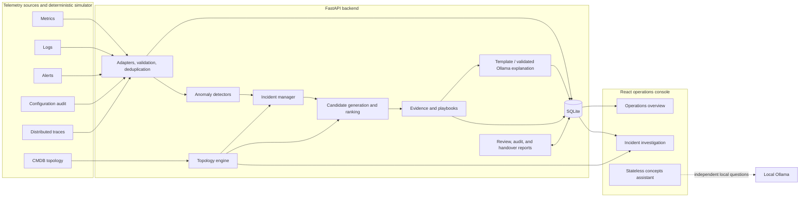
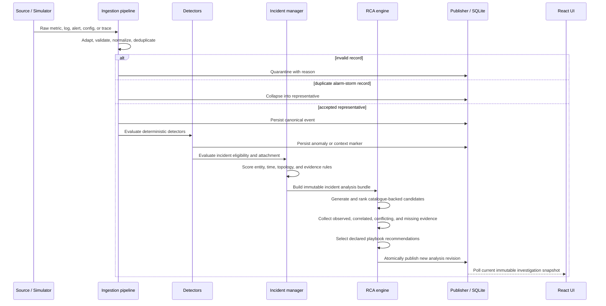

#ExTrace.ai 
## Network Anomaly Root-Cause Assistant — Technical Guide

An explainable, topology-aware network anomaly and root-cause-analysis
prototype built for deterministic local demonstration.

For a short non-technical introduction, see
[PROJECT_SUMMARY.md](./PROJECT_SUMMARY.md). The original scope and frozen
contracts are recorded in [BLUEPRINT.md](./BLUEPRINT.md).

## Contents

- [System architecture](#system-architecture)
- [Technology stack](#technology-stack)
- [Runtime data flow](#runtime-data-flow)
- [Telemetry and scenario model](#telemetry-and-scenario-model)
- [RCA and evidence model](#rca-and-evidence-model)
- [API and frontend architecture](#api-and-frontend-architecture)
- [Persistence, determinism, and safety](#persistence-determinism-and-safety)
- [Repository structure](#repository-structure)
- [Setup and run commands](#setup-and-run-commands)
- [Testing and release verification](#testing-and-release-verification)
- [Further documentation](#further-documentation)

## System architecture

The application runs as a React frontend and a FastAPI backend backed by
SQLite. A serialized orchestration boundary connects ingestion, detection,
incident management, deterministic RCA, evidence, playbooks, explanations,
human review, and audit publication.



The optional LLM does not own RCA. Deterministic services create hypotheses,
scores, evidence, and recommendations. Ollama may narrate a validated
structured bundle, and invalid or unavailable output falls back to the template
explanation.

## Technology stack

| Layer | Technology | Role |
|---|---|---|
| Backend | Python 3.12+, FastAPI, Pydantic v2 | HTTP API, typed contracts, validation |
| Persistence | SQLite, SQLAlchemy 2, Alembic | Local state, repositories, migrations |
| Analysis | NumPy, Pandas, NetworkX | Statistical processing and topology traversal |
| Dataset tooling | PyArrow and dataset bridges | Offline dataset inspection and curated profile generation |
| Frontend | React 19, TypeScript, Vite 8 | Operations and investigation UI |
| Styling | Tailwind CSS 4 | Design tokens and responsive layouts |
| Visualization | Recharts, React Flow | Incident timeline and topology graph |
| HTTP client | Axios with generated OpenAPI types | Typed frontend/backend communication |
| Reports | ReportLab | Timestamped PDF shift-handover export |
| Optional local AI | Ollama (`qwen2.5:3b` by default) | Validated narration and independent concept questions |
| Backend testing | Pytest, Ruff, MyPy | Unit, contract, integration, lint, format, type checks |
| Frontend testing | Vitest, Testing Library, MSW | Components, state, API contract fixtures |
| End-to-end testing | Playwright | MSW-disabled live browser verification |

FastAPI's generated OpenAPI document is the API source of truth. The frontend
TypeScript declarations are generated from [`backend/openapi.json`](./backend/openapi.json)
and checked for drift in the release gate.

## Runtime data flow



### Ingestion and normalization

Every source adapter maps its input into the shared `CanonicalEvent` contract.
The pipeline validates payload size and schema, enforces source provenance,
normalizes timestamps to UTC, assigns deterministic identities where required,
collapses duplicates into representative events, and quarantines invalid
records instead of silently accepting them.

### Detection

The detector service evaluates accepted events against a consistent context
containing rolling history, persisted EWMA state, configured safety thresholds,
signal aliases, topology, and recent actionable anomalies. Implemented detector
families include:

- reference and rolling z-score thresholds;
- EWMA change detection;
- log-rule and alert-severity detection;
- configuration-change markers;
- trace latency and missing-parent detection; and
- topology-cascade detection.

### Incident correlation

An actionable anomaly can open an incident. Later records are attached or
excluded using an explicit score based on entity identity, time window,
trace/session identity, topology distance, symptom-family compatibility, and
catalogue evidence rules. Every considered event retains its attachment
decision and reason codes.

### Analysis publication

RCA executes against one immutable bundle. A new `AnalysisRun` is built and
published atomically; only after all hypotheses, evidence, topology state,
recommendations, and explanations are complete does the incident's
`current_analysis_run_id` move to the new revision. Readers therefore receive
one internally consistent snapshot rather than partially updated sections.

## Telemetry and scenario model

### Logical sources

| Source | Modality | Example content |
|---|---|---|
| `simulator.prometheus` | Metric | latency, utilization, packet loss, connection counters |
| `simulator.syslog` | Log | timeouts, DNS failures, resource and HDFS errors |
| `simulator.alertmanager` | Alert | threshold and service-health alerts |
| `simulator.config_audit` | Configuration change | gateway or service configuration mutation |
| `simulator.trace` | Trace | request spans, duration, status, parent relationships |
| `fixture.cmdb_topology` | Topology | typed entities and directed dependency/traffic edges |

### Scenario catalogue

| Scenario | Primary demonstration |
|---|---|
| Gateway rate-limit disabled | Configuration regression and downstream saturation |
| Network-path degradation | Packet loss, retransmissions, and path latency |
| DDoS / SYN flood | External ingress, SYN failures, source-distribution change |
| GAIA resource saturation | CPU/memory pressure propagating to a dependent service |
| Port scan / reconnaissance | Competing external-probe, authorized-scanner, and traffic-surge hypotheses |
| HDFS DataNode failure | Storage-node errors and replica degradation |
| Distributed trace anomaly | Critical-path latency, span errors, and missing parents |
| Database connection-pool exhaustion | Database saturation and dependency timeouts |
| DNS resolution failure | Resolver errors preventing dependent connections |
| TLS certificate failure | Certificate validation and handshake failure |

The large source datasets remain under the git-ignored `data/` directory and
are not loaded during a live demo. Versioned transforms produce small curated
runtime profiles containing provenance and `REFERENCE_DERIVED` markers. Dataset
answer fields such as class labels or attack outcomes are forbidden from
runtime ingestion to prevent ground-truth leakage.

## RCA and evidence model

### Candidate generation and ranking

Hypothesis candidates are created only when catalogue signal gates match; the
system does not pad every incident to a fixed candidate count. Ranking uses
transparent factors including symptom compatibility, topology relevance,
direct logs and alerts, propagation consistency, metric anomaly strength,
change-causal fit, temporal proximity, and historical similarity.

### Evidence categories

- **Observed:** directly verified records relevant to the hypothesis.
- **Correlated:** supporting signals connected through time or topology.
- **Conflicting:** relevant records that weaken an explanation.
- **Missing:** expected facts that were not observed and should be collected.

Evidence matching is entity-scoped and run-scoped. A claim must reference
evidence belonging to the same incident, analysis revision, hypothesis, and
expected catalogue requirement.

### Topology model

The topology graph uses directed typed edges:

- `sends_traffic_to` follows request or traffic flow;
- `depends_on` identifies service dependency direction.

The engine can calculate paths and blast radius in the appropriate direction.
Published topology and recommendation display fields are snapshotted with the
analysis run so later fixture or catalogue changes cannot rewrite an existing
investigation.

### Recommendations and review

Each hypothesis declares exact diagnostic and remediation playbook step IDs.
Catalogue cross-validation prevents missing or mismatched recommendations.
Every recommendation is advisory, marked with risk and approval metadata, and
requires human approval. Confirm, reject, and request-evidence actions are
recorded as run-explicit review mutations and append-only audit records.

## API and frontend architecture

### API groups

| Prefix | Responsibilities |
|---|---|
| `/api/v1/health`, `/ready` | Process and dependency readiness |
| `/api/v1/events`, `/quarantine`, `/anomalies` | Ingestion, event feed, validation failures, detector output |
| `/api/v1/simulator` | Reset, baseline lifecycle, scenario catalogue and trigger |
| `/api/v1/incidents` | Incident list, immutable investigation, timeline, hypotheses, evidence, recommendations, explanation, review and audit |
| `/api/v1/topology` | Snapshot, typed path, and blast-radius queries |
| `/api/v1/incidents/{id}/handover.*` | Markdown and PDF shift-handover downloads |
| `/api/v1/assistant/query` | One stateless general network-concepts question |

Interactive API documentation is available at
`http://localhost:8000/docs` while the backend is running.

### Frontend pages

- **Operations overview:** source health, counters, recent detector records,
  active incidents, scenario lifecycle, and simulator controls.
- **Incident investigation:** immutable header, ranked hypotheses, evidence
  explorer, multimodal timeline, topology impact graph, explanation,
  recommendations, reviews, audit trail, and handover exports.
- **Network Concepts Assistant:** a global lower-left widget for independent
  terminology questions. It receives no page, incident, file, telemetry, or
  conversation-history context.

The frontend uses generated OpenAPI types instead of manually duplicating
backend contracts. Polling requests use cancellation and reject stale analysis
snapshots.

## Persistence, determinism, and safety

### Deterministic replay

The simulator uses a fixed virtual clock, seed, versioned fixtures, catalogues,
and stable event ordering. Baseline replay is finite: **Start** runs healthy
ticks and automatically transitions to `ready`. A triggered scenario completes
as a bounded replay. **Reset** clears demo rows, restores topology and seeded
history, resets the virtual clock, and writes a reset audit record.

Determinism applies to semantic output—not volatile database IDs or wall-clock
timestamps. The two-pass release gate normalizes volatile fields and requires
identical incidents, event order, ranks, evidence, recommendations, topology,
explanations, review, and audit behaviour.

### Safety boundaries

- Runtime code cannot read golden expected outputs or ground-truth fixtures.
- Dataset outcome columns are rejected before canonical ingestion.
- Excluded events remain visible and auditable but cannot become evidence.
- LLM output cannot create identifiers, change ranks/scores, or invent
  recommendations; invalid output falls back to the deterministic template.
- The concepts assistant is read-only and its answers never enter the RCA
  pipeline.
- No playbook is executed automatically.
- API errors use a consistent typed envelope and mutation responses include
  request identity where applicable.

## Repository structure

```text
.
├── backend/
│   ├── app/
│   │   ├── api/             # FastAPI routes and error envelopes
│   │   ├── contracts/       # Shared Pydantic domain/API contracts
│   │   ├── ingestion/       # Adapters, pipeline, dataset bridges
│   │   ├── detection/       # Statistical, rule, trace, cascade detectors
│   │   ├── incidents/       # Incident opening and evidence attachment
│   │   ├── topology/        # Typed graph paths and blast radius
│   │   ├── rca/             # Candidate generation and deterministic ranking
│   │   ├── evidence/        # Evidence requirements and collection
│   │   ├── playbooks/       # Catalogue-backed recommendations
│   │   ├── explanation/     # Template and validated Ollama narration
│   │   ├── concepts/        # Stateless Ollama concepts service
│   │   ├── reporting/       # Markdown and ReportLab PDF handover
│   │   └── orchestration/   # Serialized, atomic analysis publication
│   ├── migrations/          # Alembic migrations
│   ├── tests/               # Unit, contract and integration suites
│   └── openapi.json         # Generated backend API contract
├── frontend/
│   ├── src/api/             # Typed Axios clients
│   ├── src/components/      # Layout, UI, charts, assistant
│   ├── src/pages/           # Overview and investigation pages
│   ├── src/contracts/       # Generated OpenAPI TypeScript declarations
│   └── tests/               # Vitest and Playwright suites
├── scripts/                 # Bootstrap, generators, dataset and release tools
├── docs/                    # Decisions, extensions, handoffs and demo guide
├── data/                    # Local ignored datasets and descriptions
├── BLUEPRINT.md             # Original implementation contract
├── PROJECT_SUMMARY.md       # GitHub-friendly project overview
└── Makefile                 # Common verification commands
```

## Setup and run commands

### Prerequisites

- Python 3.12 or newer
- Node.js 22 LTS (`nvm use` reads `.nvmrc`)
- npm 10 or newer
- Ollama only if local AI features are required

### First-time setup

```bash
cp .env.example .env
./scripts/bootstrap.sh
```

Bootstrap creates `.venv`, installs locked dependencies, runs migrations,
builds deterministic fixtures, seeds the demo database, generates API types,
and validates handoffs.

### Combined development command

```bash
./scripts/dev.sh
```

This starts:

- FastAPI at `http://localhost:8000`
- React/Vite at `http://localhost:5173`

The script treats the two services as one process group: if one service fails
or cannot bind its port, the other is stopped to avoid a misleading half-running
application.

### Optional Ollama setup

```bash
.venv/bin/python -m pip install -e "backend[llm]"
ollama pull qwen2.5:3b
```

The stateless concepts assistant uses local Ollama whenever it is available.
Template incident explanations remain the default. To enable validated Ollama
narration for incident explanations too:

```bash
EXPLANATION_MODE=llm OLLAMA_MODEL=qwen2.5:3b ./scripts/dev.sh
```

### Important environment variables

| Variable | Default | Purpose |
|---|---|---|
| `DATABASE_URL` | `sqlite:///./network_anomaly_rca.db` | Synchronous SQLite database |
| `EXPLANATION_MODE` | `template` | `template` or validated `llm` narration |
| `OLLAMA_HOST` | `http://localhost:11434` | Local-only Ollama endpoint |
| `OLLAMA_MODEL` | `qwen2.5:3b` | Local narration/concepts model |
| `OLLAMA_TIMEOUT_SECONDS` | `30` | Ollama request timeout |
| `SIMULATOR_SEED` | `20260714` | Deterministic simulator seed |
| `DETECTOR_WINDOW_SECONDS` | `300` | Rolling detector context window |
| `ANOMALY_THRESHOLD` | `0.75` | Minimum actionable anomaly score |
| `INCIDENT_ATTACHMENT_THRESHOLD` | `0.40` | Minimum event attachment score |
| `FRONTEND_POLL_INTERVAL_MS` | `1500` | UI polling interval |

See [`.env.example`](./.env.example) for the complete configuration surface.

## Testing and release verification

### Common checks

```bash
make test          # backend and frontend tests
make build         # production frontend build
make check-types   # OpenAPI and generated TypeScript drift checks
make validate      # deterministic contract and handoff validation
```

### Dataset bridge validation

```bash
.venv/bin/python scripts/validate_dataset_pipeline.py
```

Raw dataset validation may report warnings for incomplete source slices. Live
demo scenarios use the curated, versioned profiles covered by integration
tests.

### Full release gate

```bash
make verify
```

The release gate performs static quality checks, secret scanning, a fresh
migration and drift check, production artifact reproduction, generated
contract checks, backend and frontend suites, a production build, and an
MSW-disabled Playwright flow. It runs the complete sequence twice with a
production reset between passes, then compares normalized semantic snapshots.

The live browser gate uses ports 8000 and 4173 by default. Alternative ports
can be supplied when a development server is already running:

```bash
LIVE_E2E_API_PORT=8001 LIVE_E2E_FRONTEND_PORT=4174 make verify
```

## Further documentation

- [Problem statement](./ProblemStatement.md)
- [Original blueprint](./BLUEPRINT.md)
- [API and contract decisions](./docs/api-decisions.md)
- [Demo script and examiner talking points](./docs/demo-script.md)
- [Reference-derived scenario extension](./docs/reference-scenario-extensions.md)
- [Shift-handover report extension](./docs/shift-handover-report-extension.md)
- [Network Concepts Assistant extension](./docs/network-concepts-assistant-extension.md)
- [Generated handoff manifest](./docs/handoff-manifest.md)
